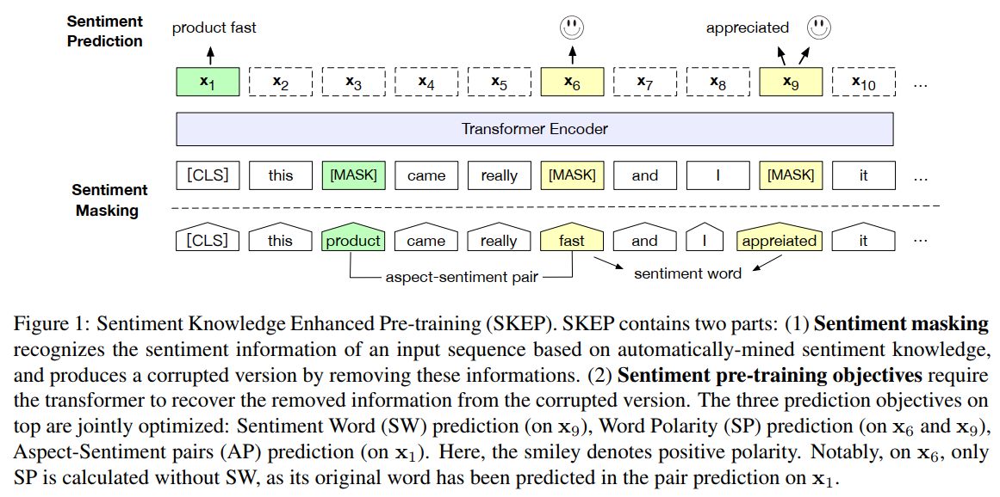
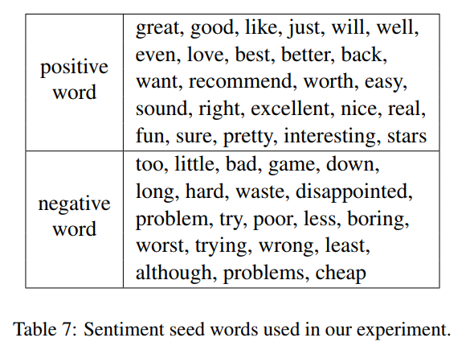

# SKEP：将情感知识融合进预训练
## 一、Motivation
&emsp;&emsp;传统方法中，完整的 ABSA 的抽取与分析往往需要训练多个模型，这是由于其使用的 PLM 在预训练时基于通用 mask 策略，或者说只关注了“**语言**”而没有关注“**语义**”。（我发明的说法...）一个很自然的想法便是**为 ABSA 设计一个 task-specified 的预训练策略**（实际上是改 mask 策略）以更好的利用文本中的情感信息。  
&emsp;&emsp;很显然这种思路***拉近了预训练与下游任务***，这也是本文的核心出发点。（好像这句话在文章中没提到hhh）

## 二、Method
### 1.总体架构

&emsp;&emsp;看起来好像很复杂，其实就是两部分：
* Sentiment masking：挖掘出原始文本中情感词、极性等情感知识，而后将其 mask 掉作为预训练输入
* Sentiment pre-training objectives：由原文本与 mask 后的平行语料根据几个训练目标进行预训练

### 2.Unsupervised Sentiment Knowledge Mining
&emsp;&emsp;(emm..感觉这部分原文说的很不清楚，而且预训练的代码也没有开源..所以我 ~~自由发挥~~ 瞎说了一部分)  
&emsp;&emsp;基于 Pointwise Mutual Information：  
&emsp;&emsp;补课：[Peter D Turney. Thumbs up or thumbs down?:semantic orientation applied to unsupervised classification of reviews. (ACL 2002)](https://aclanthology.org/P02-1053.pdf)  
&emsp;&emsp;PMI 简单说来就是使用统计方法来衡量两个随机变量间的相关性：
$$
PMI(x,y)=\log \frac{p(x,y)}{p(x)p(y)}
$$
&emsp;&emsp;这里呢，我们的目标是分析出***情感极性词***（如上文中的 fast 与 appreciate）和方面词-情感词对（product-fast）。取 x 为原文本中的每个 token，y 为一系列种子词：  

&emsp;&emsp;计算 x 的极性：  
$$
WP(x)=\sum_{y=+}PMI(x,y)-\sum_{y=-}PMI(x,y)
$$
&emsp;&emsp;给定一阈值 $\pm WP_0$，若 $WP(x)>+WP_0$，则 x 为正极性词；若 $WP(x)<-WP_0$，则 x 为负极性词。  
&emsp;&emsp;得到极性词后，将其与***最近的名词（3个 token 以内）***组合成为方面词-情感词对。