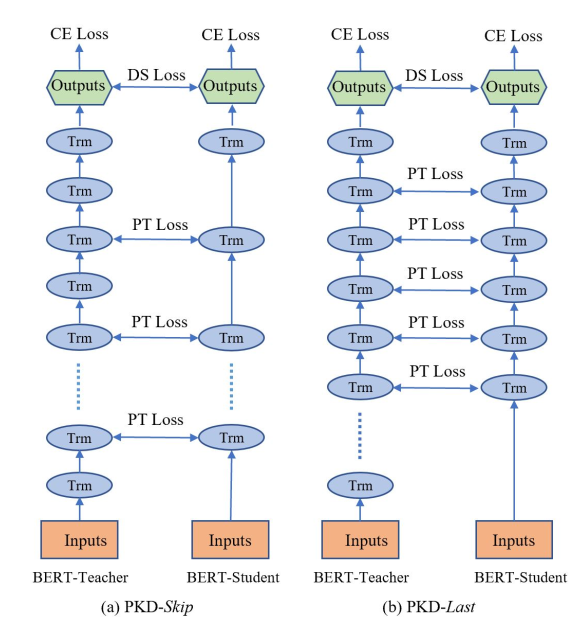

# BERT-PKD：蒸馏中间层的知识

&emsp;&emsp;既然BERT有那么多层，是不是可以蒸馏中间层的知识，让学生模型更好地拟合呢？这篇文章 Patient Knowledge Distillation，即从教师模型的中间层提取知识，避免在蒸馏最后一层时拟合过快的现象（有过拟合的风险）。  
&emsp;&emsp;它最主要是在之前提到两个损失之上，再加上一个 $L_{PT}$ Loss，刻画的是两模型中间隐层状态的差异。具体而言即：  
$$
L_{PT}=\sum\limits_{i=1}^{bs}\sum\limits_{j=1}^{S\_n\_layers}	\left \| \frac{\boldsymbol{h}^{[CLS]}_{T,ij}}{\left \| \boldsymbol{h}^{[CLS]}_{T,ij} \right \|_2^2} -\frac{\boldsymbol{h}^{[CLS]}_{S,ij}}{\left \| \boldsymbol{h}^{[CLS]}_{S,ij} \right \|_2^2} \right \|_{2}^2
$$
&emsp;&emsp;总体 Loss 即：$\mathcal{L}=(1-\alpha)L^S_{CE}+\alpha L_{DS}+\beta L_{PT}$，其中 $L_{CE}$ 为 task-specified 的 Loss，$L_{DS}$ 为蒸馏 Loss：二者预测分布的交叉熵。  
&emsp;&emsp;还有一个细节便是 student 的隐层与 teacher 的哪一层对应，文中给出了两个思路：  

&emsp;&emsp;PKD-Skip 略好。
