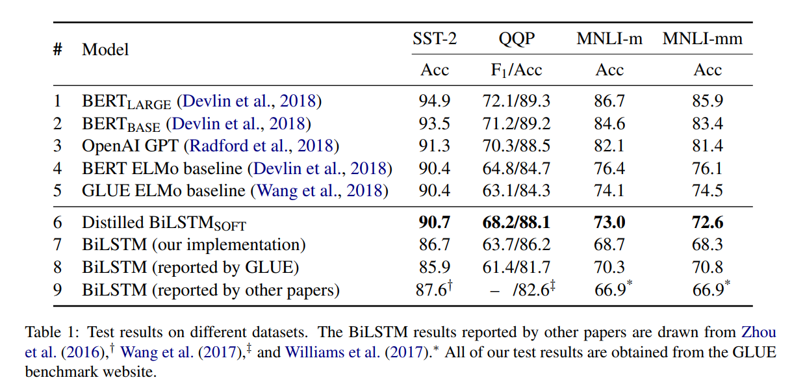

# DistilLSTM：借助 BERT 突破 LSTM 上限
&emsp;&emsp;论文中的处理很简单，采用 logits 之间的 MSE 刻画蒸馏 loss。  
&emsp;&emsp;论文结果：  

&emsp;&emsp;我的复现：  
|  模型   | SST2 ACC |
|  :--:  | :--:  |
| BRRT base | 92.08 |
| BiLSTM | 84.17 |
| Finetuned BERT -> BiLSTM |  |

&emsp;&emsp;没太精细调参了，只是为了验证蒸馏的可行性，效果还是很不错的。  
&emsp;&emsp;文章中还提出了三种数据增强的方法来人为的扩充数据集，防止过拟合：  
* Masking：使用 [mask] 标签来随机替换一个 token；
* POS-guided word replacement：将一个单词替换为相同 POS 标签的随机单词。例如，“What do pigs eat?"替换为"How do pigs eat?"。
* n-gram sampling：随机采用n-gram，n从1到5，并丢弃其它单词。
&emsp;&emsp;不过论文没做消融，我这里为了省事也没做了。此外还试了其他的蒸馏 loss：  
|  蒸馏方法   | SST2 ACC |
|  :--:  | :--:  |
| 广义 softmax 交叉熵（Hinton） |  |
| 广义 softmax 的 KL 散度 |  |