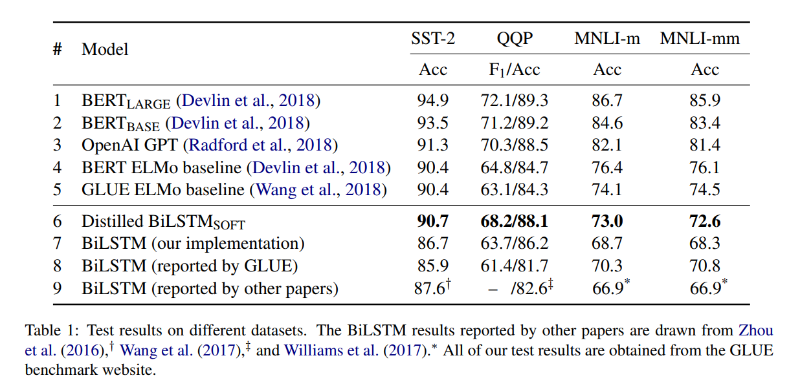

# DistilLSTM：借助 BERT 突破 LSTM 上限
## 一、Methods & Reproduction 
&emsp;&emsp;论文中的处理很简单，采用 logits 之间的 MSE 刻画蒸馏 loss。  
&emsp;&emsp;论文结果：  

&emsp;&emsp;我的复现：  
|  模型   | SST2 ACC |
|  :--:  | :--:  |
| BRRT base | 92.08 |
| BiLSTM | 84.17 |
| Finetuned BERT -> BiLSTM | 85.57 |

&emsp;&emsp;效果还可以，不过由于没有仔细调参，结果没有原文中的那么惊艳。  
&emsp;&emsp;文章中还提出了三种数据增强的方法来人为的扩充数据集，防止过拟合：  
* Masking：使用 [mask] 标签来随机替换一个 token；
* POS-guided word replacement：将一个单词替换为相同 POS 标签的随机单词。例如，“What do pigs eat?"替换为"How do pigs eat?"。
* n-gram sampling：随机采用n-gram，n从1到5，并丢弃其它单词。

&emsp;&emsp;不过论文没做消融，我这里为了省事直接没有用数据增强的方法。

## 二、Conclusion
&emsp;&emsp;从原文中的结果表格可以看到，虽然蒸馏后的 BiLSTM 效果依旧不如 BERT，但是相比自己的 baseline，在没有任何模型结构的变化下，即可有明显的提升效果，换言之，其实我们可以认为当前的数据和训练方式目前依旧没有完全发挥特定模型结构的所有知识存储和表达能力，在更为高级模型的帮助下浅层模型仍然有进一步提升的空间，简单地说，***BiLSTM没有被充分学习***。