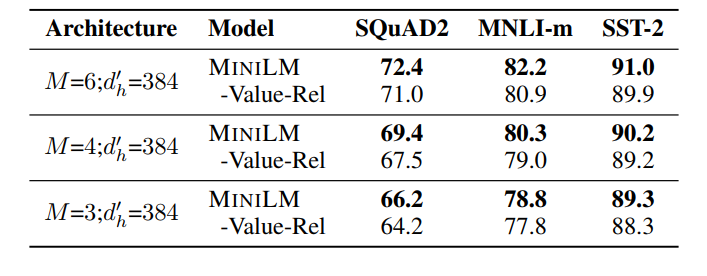
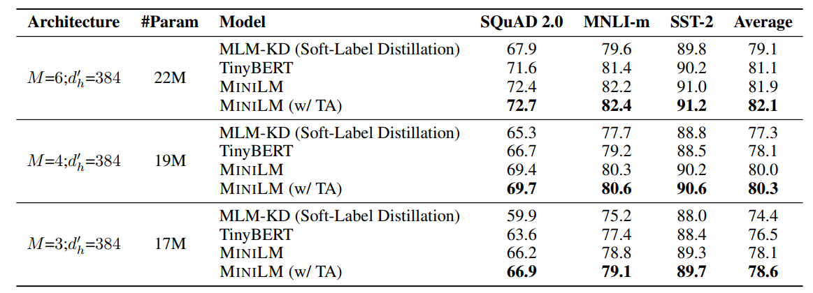

# MiniLM
&emsp;&emsp;之前的文章几乎把 Transformer 中能蒸的都蒸过了，而我们的 MiniLM 找到了最后一块净土：Value 矩阵
## 一、Overview
&emsp;&emsp;MiniLM 的主要技术如下：  
* 单层蒸馏：只对齐 teacher 与 student 的最后一层；
* 对齐 Attention 矩阵与 Value 矩阵：除了常规对齐 Attention 矩阵外，还对齐了 Value 矩阵，使用 KL 散度计算 Loss；
* 助教机制：构建一个中间模型作为助教，其有与 teacher 相同的层数和与 student 相同的 $d\_size$。

## 二、Details
&emsp;&emsp;先上图，非常直观明了：  

&emsp;&emsp;训练目标有三个：常规蒸馏 Loss $\mathcal{L}_{KD}$，刻画 Attention 矩阵的 $\mathcal{L}_{AT}$ 以及刻画 Value 矩阵的 $\mathcal{L}_{VR}$。  
&emsp;&emsp;$\mathcal{L}_{AT}$ 如下：  
$$
\mathcal{L}_{AT}=\frac{1}{hL}\sum\limits_{i=1}^{h}\sum\limits_{j=1}^{L}KL(\boldsymbol{A}_{i,j}^{(T)}||\boldsymbol{A}_{i,j}^{(S)})
$$
&emsp;&emsp;其中 $h$ 为 head 数，$L$ 为 sequence length，$\boldsymbol{A}^{(T)},\boldsymbol{A}^{(S)}$ 分别是 teacher 与 student 最后一层的注意力矩阵（softmax 后的）。  
&emsp;&emsp;$\mathcal{L}_{VR}$ 有个小处理，考虑到 teacher 与 student 的 value 矩阵大小不一致，先计算 value-relation：  
$$
\boldsymbol{VR}_{i,j}^{(T)}=softmax(\frac{\boldsymbol{V}_{i,j}^{(T)}\boldsymbol{V}_{i,j}^{(T){\intercal}}}{\sqrt d_k})
$$
&emsp;&emsp;这样二者的维度都变成了 $h\times L\times L$，然后就可以愉快地用 KL 了：  
$$
\mathcal{L}_{VR}=\frac{1}{hL}\sum\limits_{i=1}^{h}\sum\limits_{j=1}^{L}KL(\boldsymbol{VR}_{i,j}^{(T)}||\boldsymbol{VR}_{i,j}^{(S)})
$$
&emsp;&emsp;可以看到，这种处理比起之前的论文中额外做一个矩阵变换强行将维度统一效果要更好一些：  

&emsp;&emsp;$\mathcal{L}_{VR}$ 的消融结果：  

## 三、Experiments
&emsp;&emsp;总体效果如下图，相当可以：  

&emsp;&emsp;teacher assistant 机制的消融：  

&emsp;&emsp;Layer-to-Layer 与只蒸馏最后一层效果对比：  

&emsp;&emsp;除了用 BERT base 做 teacher 以外，还用了 XLM 做了多语言的实验，具体结果就不多赘述了。