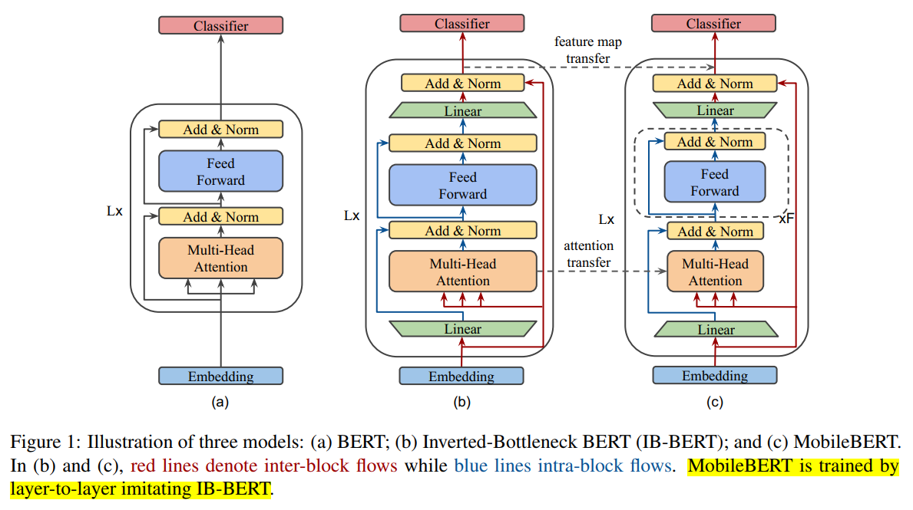
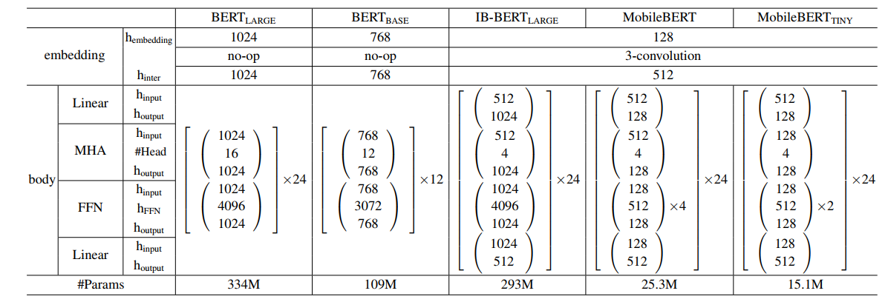
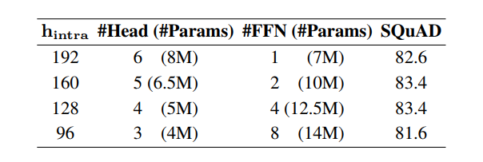
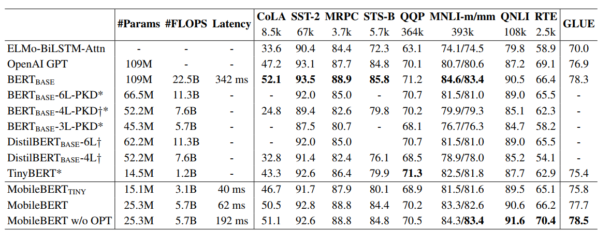
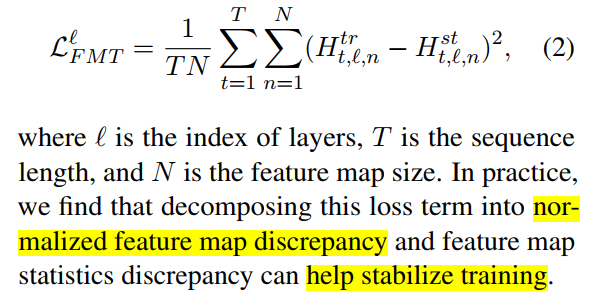
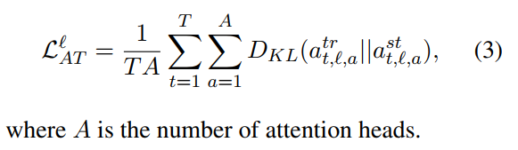
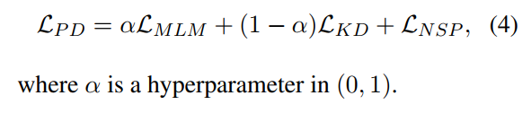
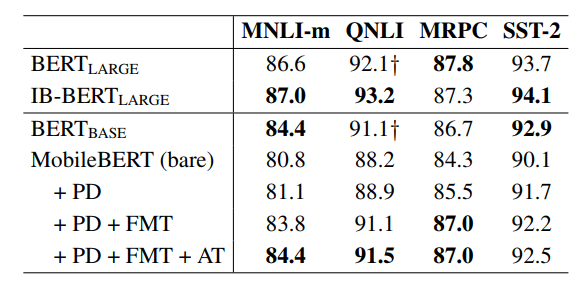
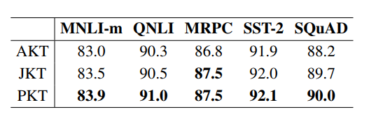

# MobileBERT：变窄而不是变浅
## 一、Overview
&emsp;&emsp;MobileBERT 主要技术如下：  
* Inverted-Bottleneck: 模型改动，让模型变窄而不是变浅。
* Stacked Feed-Forward Network: 保证 Attention 部分和全连接部分的参数比，从而保证效果。
* Operational Optimizations：移除 LayerNormalization，同时将 Gelu 激活函数换成更快的Relu。
* 多种 Loss。
* 多种蒸馏策略。

## 二、Inverted-Bottleneck（IB）
&emsp;&emsp;MobileBERT 最大的改动即是将模型变窄而不是变浅，而实验发现直接砍 Transformer block 的各个维度掉点很厉害，所以引入了 Inverted-Bottleneck 机制，核心就是 ***在每个 block 前后添加两个线性层，以保证各个 block 的输出维度相同。***  
&emsp;&emsp;模型的总体结构如下（右一）：  

<center></center>

&emsp;&emsp;而直接训练 MobileBERT(c) 比较困难，所以先训练一个 IB-BERT(b) 而后再蒸馏。回过头来看 Inverted-Bottleneck，这样“宽进宽出中间窄”的设计很明显可以让 teacher 和 student 的 block 对齐，思路非常自然。  
&emsp;&emsp;为什么不从 BERT(a) 直接蒸馏到 MobileBERT(c)？我们看下面的图：  
<center></center>

&emsp;&emsp;我们会发现在 Embedding 层，MobileBERT 采用的是 128 的输入+1D卷积（卷积核为 3），实际上在代码中是将128维的输入做了 3-gram 再过了一个线性层，这样的 embedding 与 BERT 差异较大，所以引入 IB-BERT(b) 在 BERT Large 的基础上改进了 embedding 层，缩小了 MobileBERT 与 BERT 间的差异。  

## 三、Stacked Feed-Forward Network
&emsp;&emsp;我们知道，Transformer block 分为 Multi-Head Attention 和 Feed Forward 两个部分，这两个部分有各自的功能：  
* Multi-Head Attention：负责捕捉不同位置的信息。
* 全连接层：增加模型的非线性表达能力。

&emsp;&emsp;作者发现在标准 BERT 中，MHA 与 FFN 的参数比为 ***1:2***，这个参数比相比其他比例更好。引入 Inverted-bottleneck 后，这两部分的参数矩阵此消彼长，Attention 部分变多，而全连接层变少。所以为了维持这种比例，将原有的 FFN 复制几份，也就是上图（c）中 $\times$F 的原因。  
<center></center>

&emsp;&emsp;还是有影响的。  

## 四、Operational Optimizations(OPT)
&emsp;&emsp;为了简化计算，作者去掉了 LN，采用了 NoNorm：  
$$
NoNorm(\boldsymbol{h})=\boldsymbol{\gamma}\circ\boldsymbol{h}+\boldsymbol{\beta}
$$
&emsp;&emsp;其中 $\circ$ 为矩阵按位相乘。除此之外，还将 GeLU 换成了 ReLU。  
```
class NoNorm(nn.Module):
    def __init__(self, feat_size, eps=None):
        super().__init__()
        self.bias = nn.Parameter(torch.zeros(feat_size))
        self.weight = nn.Parameter(torch.ones(feat_size))

    def forward(self, input_tensor):
        return input_tensor * self.weight + self.bias
```
&emsp;&emsp;效果还可以，掉了些点但是快不少。  
<center></center>

## 五、多种 Loss
* Feature Map Transfer(FMT)：即让 student 去拟合 teacher 的 Feature Map，即每个 Transformer Block 的输出。（有点像 BERT-PKD）
<center></center>

* Attention Transfer(AT): 即让 student 去拟合 teacher 的 Attention 矩阵。（TinyBERT 的思想）
<center></center>

* Pre-training Distillation(PD)：蒸馏损失，MLM、NSP 和 KD，也就是常规蒸馏 loss。
<center></center>

&emsp;&emsp;消融结果：  
<center></center>


## 六、多种蒸馏策略
* AKT：一次性蒸馏所有层；
* JKT：先蒸馏中间层再蒸馏最后一层；
* PKT：逐层蒸馏；

&emsp;&emsp;讲了很多故事，实验结果显然是逐层蒸馏最后，但是只提了零点几个点，性价比相当低了。  
<center></center>
