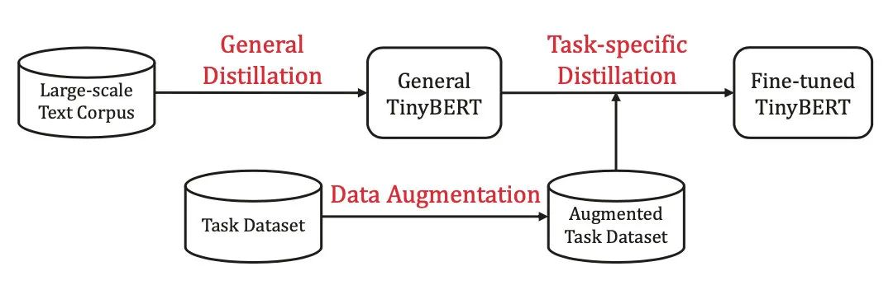
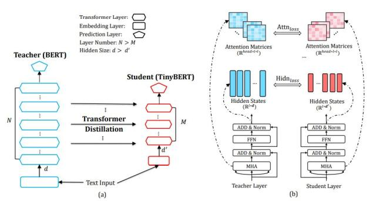
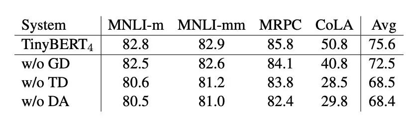

# TinyBERT：蒸馏的小集成之作

&emsp;&emsp;如标题所言，TinyBERT 算是前面几篇论文的小集成了，同样是层次剪枝+蒸馏，除了预测层蒸馏外，还蒸了注意力层与 Embedding 层，具体流程见下图，还是很清晰的。  

&emsp;&emsp;还有一个值得注意的细节，预测层用的是常规广义 softmax 后的 CE，而中间层与 Embedding 层用的是 Logits 的 MSE，文中指出 softmax-CE 收敛不好但泛化不错，而 logits 的 MSE 收敛快但泛化不好。这是因为使用 softmax-CE 需要学到整个概率分布，更难收敛，因为拟合了 teacher BERT 的概率分布，有更强的泛化性。MSE 对极值敏感，收敛的更快。  
&emsp;&emsp;消融结果：  

&emsp;&emsp;消融的结果有点“本末倒置”的感觉。GD(General Distillation) 表示预训练蒸馏，TD(Task Distillation) 表示精调阶段蒸馏，DA(Data Augmentation) 表示数据增强，主要用于精调阶段。从消融实验来看GD带来的提升不如TD或者DA，TD和DA对最终结果的影响差不多（..）
