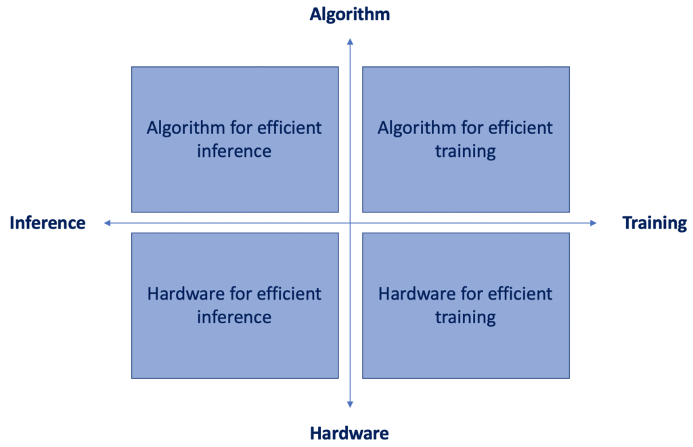

# Bring NLP to Edge
One trend in AI  is to deploy high performance models on mobile/embedded devices.  
Challenges: ***low memory resources***, ***low processor performance*** --> how to design lightweight models?  
Running neural networks on resource-constrained devices requires joint solutions from data engineering and data science: (figure from [[Song Han class]](https://www.youtube.com/watch?v=eZdOkDtYMoo))  

## 0. Surveys & Overview
* **Bringing AI To Edge: From Deep Learning's Perspective**  *Di Liu, Hao Kong, Xiangzhong Luo, Weichen Liu, Ravi Subramaniam*  [[pdf]](https://arxiv.org/pdf/2011.14808.pdf)

## [1. Efficient Model Architectures](https://github.com/HJHGJGHHG/NLPPapers/tree/main/PLM/Computational%20Efficiency/Efficient%20Model%20Architectures)
Reduce the computational complexity of the transformer-based model.   

## 2. Model Compression
Making the model lightweight.  
##### 2.0 Overview
* **Compression of Deep Learning Models for Text: A Survey**.  *Manish Gupta, Puneet Agrawal*.  (ACM TKDD 2021)  [pdf](https://arxiv.org/pdf/2008.05221.pdf)
##### 2.1 [Knowledge Distillation](https://github.com/HJHGJGHHG/NLPPapers/tree/main/Edge%20intelligence%EF%BC%88NLP%EF%BC%89/Knowledge%20Distillation)