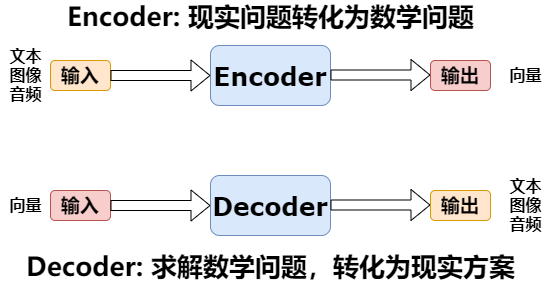
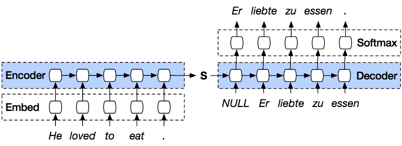
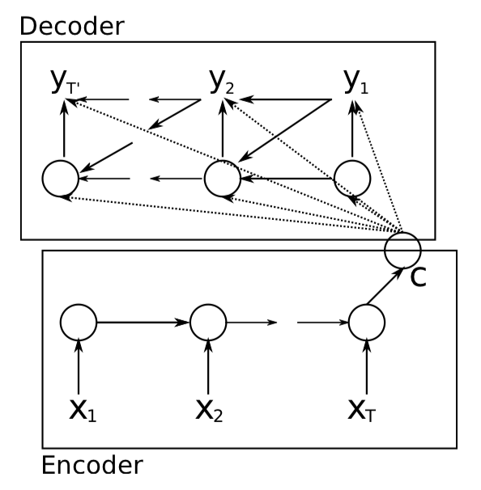
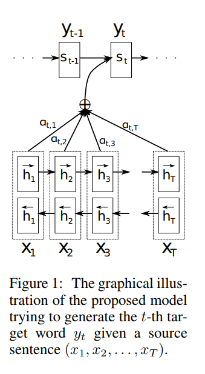
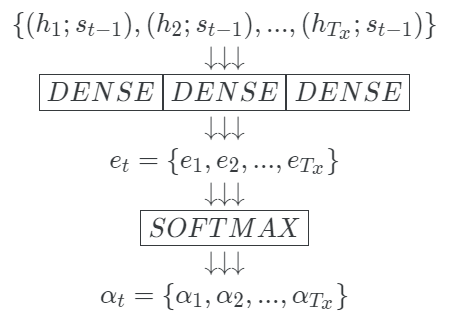

# NLP Attention 的开篇之作
> 写在前面：这篇文章是在写选修课论文时写就的。收集资料时，发现很多所谓的 attention 总结无非最后都陷入了对 transformer 模型和自注意力机制的解释中，这对初学者而言很容易陷入一个思维定势中。因此重新找来这篇开山之作，从注意力机制的源头：Encoder-Decoder 说起。

## 一、Seq2Seq 与 神经网络机器翻译
&emsp;&emsp;学习注意力机制，不得不提到它的背景，即 Seq2Seq 任务。Seq2seq 模型最早在 bengio 等人的论文《Learning Phrase Representations using RNN Encoder–Decoder for Statistical Machine Translation》中初显，随后 Sutskever 等人在文章《Sequence to Sequence Learning with Neural Networks》中提出改进模型即为目前常说的 Seq2Seq 模型。
&emsp;&emsp;**从广义上讲，Seq2Seq 的目的是将输入序列（源序列）转换为新的输出序列（目标序列）**。根据两个序列的长度、格式、语言等的不同又分为很多任务。如二者语言不同则为翻译；二者语言相同则有摘要、标题生成等任务。
&emsp;&emsp;Seq2Seq 任务中最经典的则是机器翻译，在深度学习兴起后，机器翻译主要采用神经网络的方法，是为神经网络机器翻译（Neural Machine Translation, NMT）。Seq2Seq 提出之后，普遍采用 Encoder-Decoder 模型建模。Encoder-Decoder 是指一种思想，即将现实问题转换为数学表达，再转换为现实世界的解决方案。图示为：

&emsp;&emsp;而在 NMT 中，Encoder 与 Decoder 用循环神经网络建模，二者间的链接向量称为上下文语义向量(Context Vector)，即：

&emsp;&emsp;最开始时语义向量仅作为 Decoder 第一个单元的隐藏层输入（上图），而改进后的 Encoder-Decoder 中的 语义向量将输入至 Decoder 的每一个单元。也即 Decoder 将根据语义向量 $\overrightarrow c$  与生成的历史词 $\{y_1,y_2,\cdots,y_{t-1}\}$ 来生成 $y_t$ 。

&emsp;&emsp;这种架构有什么局限呢？
* **信息损失**：语义向量 $\overrightarrow c$ 是**固定长度**的，当句子较长时，所有语义完全通过一个中间语义向量来表示，单词自身的信息已经消失，会丢失很多的细节信息。
* **焦点分散**：将同一个语义向量传给所有 Decoder 单元，也即翻译不同的单词时，原始语义信息对其贡献是一样的，这有悖于人类的翻译模式。

## 二、对齐（Alighment）
&emsp;&emsp;我们刚刚提到普通的 Encoder-Decoder 模型有焦点分散的问题，我们回想人类的翻译模式，我们在翻译每一个单词时，都会去原文中寻找关键词，而翻译后的句子中，一个单词的所处位置与其关键词大致对应。这便是 ***对齐*** 的概念，可理解为对于原文中所有单词语义的加权。**不同单词，其原文中各单词对它的翻译贡献也不同**，这便是 Attention 机制的思想来源。
&emsp;&emsp;这种思想应用在我们的 Encoder-Decoder 中，则是：**Encoder 不再将整个输入序列编码为固定长度的中间语义向量 $\overrightarrow c$，而是根据当前生成的新单词计算新的  $\overrightarrow c_{t}$，使得每个时刻输入不同的语义向量**。这样既解决了单词信息丢失又解决了焦点分散问题。

## 三、模型架构
&emsp;&emsp;有了一些思想基础后，我们来看原文中是如何实现的。对于时间步 $i$ 下 Decoder 的输出 $y_i$ 也就是翻译后的词为：
$$
y_i=p(y_i|y_1,y_2,\cdots,y_{i-1},\overrightarrow {\mathbf{x}})=g(y_{i-1},s_{i},c_i)
$$
&emsp;&emsp;其中的 $s_i$ 是 Decoder 在时间步 $i$ 下的隐藏层状态；$c_i$ 是需要我们得到的动态语义向量，也就是注意力的关键所在。
&emsp;&emsp;为了得到 $c_i$，我们在 Encoder 与 Decoder 间加入 Attention 层，模型架构如下：

&emsp;&emsp;$c_i$ 有公式：
$$
\begin{alignat}{2}
c_i = \sum_{j=1}^{T} a_{ij}h_j
\end{alignat}
$$
&emsp;&emsp;$h_j$ 是时间步 $j$ 下的输入 $x_j$ 对应的 Encoder 隐藏层状态。对于图中的模型，Encoder 由双向 RNN 构成，则 $h_j=[\overrightarrow h_j; \overleftarrow h_j]$，即把前向后向 RNN 得到的隐状态向量进行拼接。关键在于权值 $a_{ij}$ 的计算。有公式：

$$
\begin{alignat}{2}
a_{ij}&=\frac{exp(e_{ij})}{\sum_{k=1}^T exp(e_{ik})}\\
e_{ij}&=dense(s_{i-1},h_j)
\end{alignat}
$$
&emsp;&emsp;$a_{ij}$ 由时间步 $i$ 下 $e_{ij}$ 通过 $softmax$ 而成，而 $e_{ik}$ 由全连接层产生。 这个全连接层也被称为 ***对齐模型***。$e_{ik}$ 刻画了输入 $h_k$ 与隐藏层状态 $s_{i-1}$ 的相似程度，之所以称为 *对齐* ，是因为 $s_{i-1}$ 中含有之前翻译的信息，$h_j$ 中含有原文第 $j$ 个单词的上下文信息，利用 $s_{i-1}$ 就是告诉模型接下来应该翻译第 $i$ 个词；利用 $h_j$ 就是告诉模型上个翻译的单词对应原文中的什么位置。综合 $s_{i-1}$ 与 $h_j$ 的信息得到的 $c_i$ 能更充分地刻画前文语义。

&emsp;&emsp;下面的动图能更清楚地展现整个过程。

