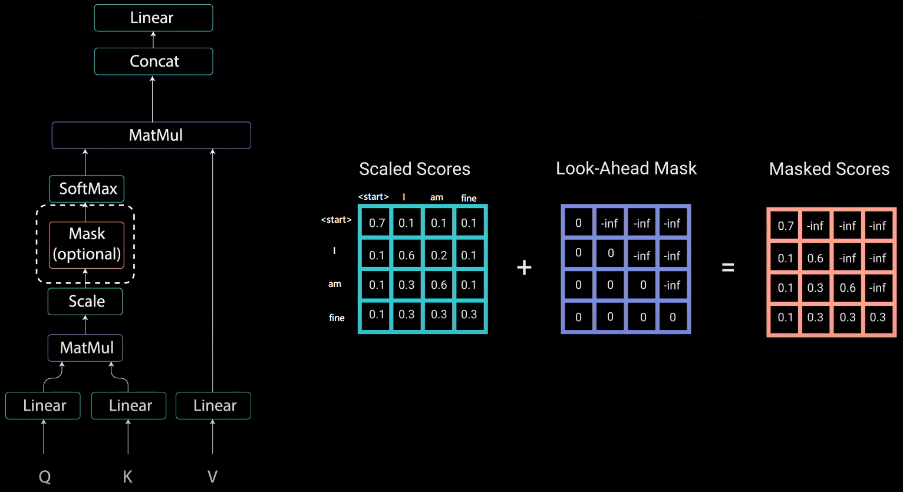

# Attention in Transformer
## 一、Self Attention（Encoder）
&emsp;&emsp;公式：
$$
Attention(\mathbf{Q},\mathbf{K},\mathbf{V})=softmax(\frac{\mathbf{Q}\mathbf{K}^T}{ \sqrt{d_k}})\mathbf{V}
$$
&emsp;&emsp;其中 $\mathbf{Q}\in \mathbb{R}^{n\times d_k}$，$\mathbf{K}\in \mathbb{R}^{m\times d_k}$，$\mathbf{V}\in \mathbb{R}^{m\times d_v}$。而 Self-Attention 的情况下$\mathbf{Q}，\mathbf{K}，\mathbf{V}\in \mathbb{R}^{n\times d}，d=d_{model} / n\_heads$。本质是序列变换：从 $\mathbf{X}\in \mathbb{R}^{n \times d_{model}}$变换到$\mathbf{Z}\in \mathbb{R}^{n\times d}$。

$$
\mathbf{Z}=softmax(\frac{(\mathbf{XW_Q})(\mathbf{XW_K})^T}{\sqrt{d}})(\mathbf{XW_V})
$$

&emsp;&emsp;思考：
1. 为什么要除以 $\sqrt{d_k}$ ？

&emsp;&emsp;原文如下：
> We suspect that for large values of $d_k$, the dot products grow large in magnitude, pushing the softmax function into regions where it has extremely small gradients. To counteract this effect, we scale the dot products by $\frac{1}{\sqrt{d_k}}$.

&emsp;&emsp;所以$\sqrt{d_k}$是一个调节因子，得内积不至于太大，否则 softmax 后就非0即1了，梯度会有问题。基于纯 Transformer 的实验如果不收敛，检查有没有除$\sqrt{d_k}$！！

2. 要不要 softmax ？

TODO

## 二、Multi-Head Attention（Encoder）
&emsp;&emsp;上文说到一次 Self-Attention 会把 $\mathbf{X}\in \mathbb{R}^{n \times d_{model}}$ 变换到 $\mathbf{Z}\in \mathbb{R}^{n\times d}$，那么重复$n\_heads$次再拼接结果，得到 Attention 层的最终输出序列。
&emsp;&emsp;那么问题来了，重复 $n\_heads$ 有何意义？原文是怎么说的：

> Multi-head attention allows the model to jointly attend to information from different representation subspaces at different positions. With a single attention head, averaging inhibits this.

&emsp;&emsp;原论文中说到进行 Multi-head Attention 的原因是将模型分为多个头，形成多个子空间，可以让模型去关注不同方面的信息，最后再将各个方面的信息综合起来。其实直观上也可以想到，如果自己设计这样的一个模型，必然也不会只做一次 attention，多次 attention 综合的结果至少能够起到增强模型的作用，也可以类比 CNN 中同时使用多个卷积核的作用，直观上讲，多头的注意力有助于网络捕捉到更丰富的特征 / 信息。

## 三、Mask Self Attention（Decoder）
&emsp;&emsp;Decoder中的Self Attention与Encoder主体类似，增加了一个 Mask 步骤。例如：

* encoder input：我/爱/机/器/学/习
* ground truth：I/love/machine/learning
* decoder input：<start>/I/love/machine/learning
*  target：I/love/machine/learning/<end>

&emsp;&emsp;为了并行计算出 decoder output，我们需要进行 Mask 操作。具体来说，传统 Seq2Seq 中 Decoder 使用的是 RNN 模型，因此在训练过程中输入 $t$ 时刻的词，模型无论如何也看不到未来时刻的词，因为循环神经网络是时间驱动的，只有当 $t$ 时刻运算结束了，才能看到 $t+1$ 时刻的词。而 Transformer Decoder 抛弃了 RNN，改为 Self-Attention，由此就产生了一个问题，在训练过程中，整个 ground truth 都暴露在 Decoder 下，这不是妥妥的抄答案么，与常规的翻译过程不合。
&emsp;&emsp;那么如何让第 $t+1$ 个词只获得前 $t$ 个词的信息呢？我们考虑在 Attention Scaled Score矩阵上做文章。
&emsp;&emsp;其实 Mask 非常简单，首先生成一个下三角全 0，上三角全为负无穷的矩阵，然后将其与 Attention Scaled Score 矩阵按位相加：
$$
\begin{align}
Mask\ Self\ Atte&ntion=softmax(\frac{\mathbf{Q}\mathbf{K}^T}{ \sqrt{d_k}}+\mathbf{M}_{n\times n})\mathbf{V}\\
\mathbf{M}_{n\times n}=&
\begin{bmatrix}
0 & (-inf) & \cdots & (-inf) \\
0 & 0 &\cdots & (-inf) \\
\vdots & \vdots & \ddots &\vdots \\
0 & 0 & \cdots & (-inf)\\
0 & 0 & \cdots & 0\\
\end{bmatrix}_{n\times n}
\end{align}
$$

&emsp;&emsp;经 softmax 后，-inf的部分即变为零，可认为是没有相关。

## 四、Encoder-Decoder Attention（Decoder）
&emsp;&emsp;其实这一部分的计算流程和前面 Encoder 中的 Self-Attention 很相似，结构也一摸一样，唯一不同的是这里的 $\mathbf{K}，\mathbf{V} $ 为 Encoder 的输出，$\mathbf{Q}$ 为 Decoder 中 Masked Self-Attention 的输出