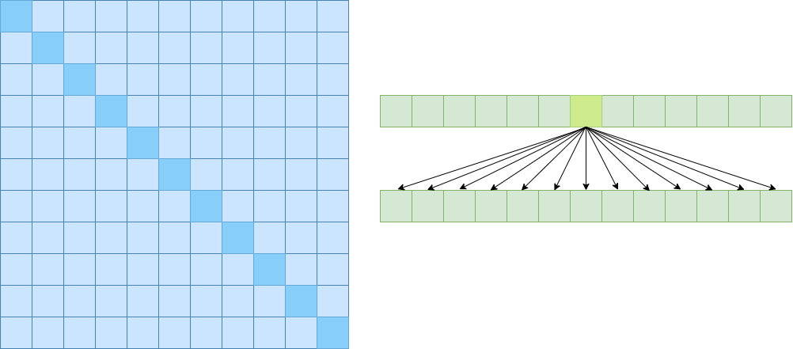
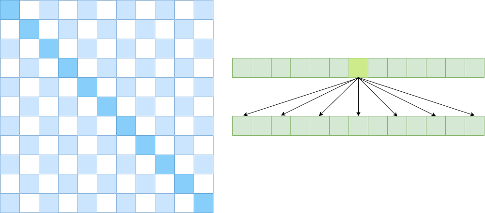
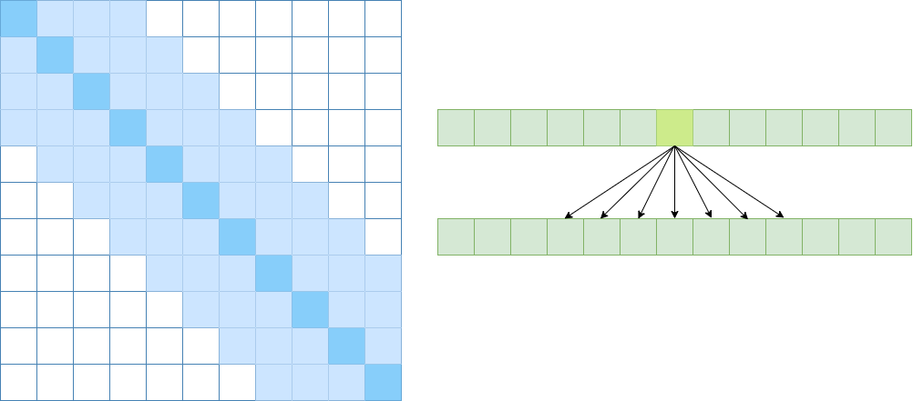
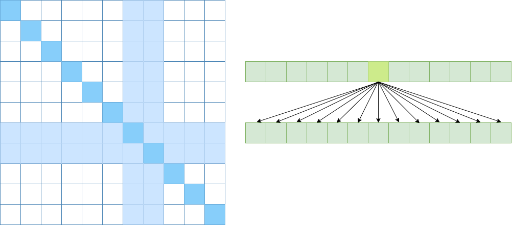
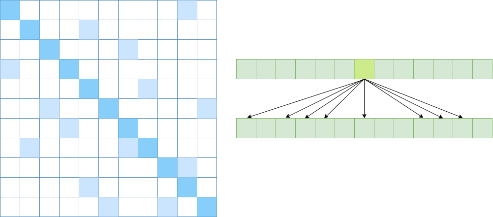
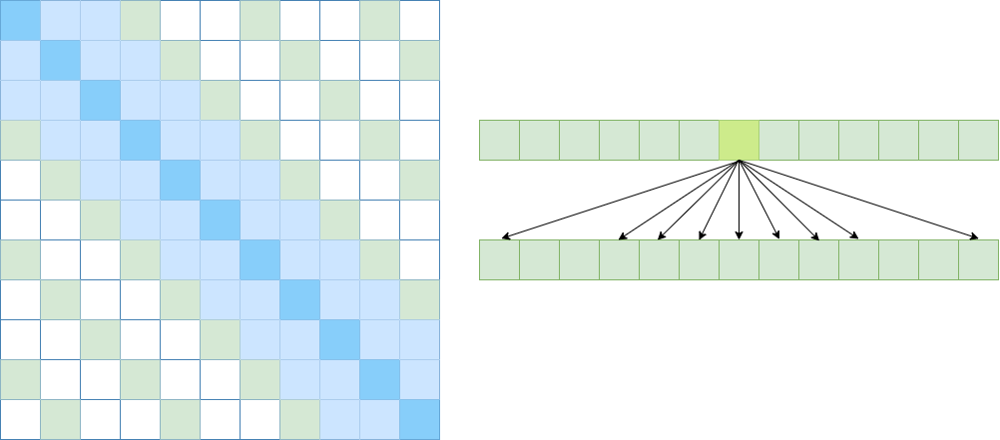

# 高性能 Transformer
## 一、线性化：自注意力线性复杂度的探索
### 1. 从原始公式开始
&emsp;&emsp;回顾经典 Transformer-Based 的预训练模型，用的最多的还是  scaled-dot self-attention:  
$$
Attention(\boldsymbol{Q},\boldsymbol{K},\boldsymbol{V}) = softmax(\frac{\boldsymbol{Q}\boldsymbol{K}^{T}}{\sqrt{d_k}})\boldsymbol{V}
$$
&emsp;&emsp;其中 $\boldsymbol{Q}=\boldsymbol{K}=\boldsymbol{V}\in\mathbb{R}^{n\times d}$，为了简单考虑，忽略缩放因子 $d_k$。我们把公式1写开：  
$$
\begin{align}
Attention(\boldsymbol{Q},\boldsymbol{K},\boldsymbol{V})_{ij} &=softmax((\boldsymbol{Q}\cdot\boldsymbol{K}
)_i)\cdot \boldsymbol{v}^T_j\\
&=\frac{\sum\limits_{r=1}^n e^{\boldsymbol{q}_i\cdot \boldsymbol{k}_r^T}\cdot v_{jr}^T}{\sum\limits_{r=1}^n e^{\boldsymbol{q}_i\cdot \boldsymbol{k}_r^T}}
\end{align}
$$
&emsp;&emsp;其中 $Attention(\boldsymbol{Q},\boldsymbol{K},\boldsymbol{V})_{ij}$ 表示最终结果的第 $i$ 行 $j$ 列；$\boldsymbol{q}_i, \boldsymbol{k}_r,\boldsymbol{v}_j$ 均为 *行* 向量。  
&emsp;&emsp;同样有：  
$$
Attention(\boldsymbol{Q},\boldsymbol{K},\boldsymbol{V})_i = \frac{\sum\limits_{j=1}^n e^{\boldsymbol{q}_i\cdot\boldsymbol{k}_j^T} \cdot\boldsymbol{v}_j}{\sum\limits_{j=1}^n e^{\boldsymbol{q}_i\cdot\boldsymbol{k}_j^T}}
$$
&emsp;&emsp;所以本质上是以 $e^{\boldsymbol{q}_i\cdot\boldsymbol{k}_j^T}$ 对 $\boldsymbol{v}_j$ 做了加权平均，我们可以提出一个更广义上的 attention：  
$$
Attention(\boldsymbol{Q},\boldsymbol{K},\boldsymbol{V})_i = \frac{\sum\limits_{j=1}^n sim(\boldsymbol{q}_i, \boldsymbol{k}_j)\boldsymbol{v}_j}{\sum\limits_{j=1}^n sim(\boldsymbol{q}_i, \boldsymbol{k}_j)}
$$
&emsp;&emsp;但是为了保留相似的分布特性，必须保证 $sim(\cdot,\cdot)\geq 0$，而且一个很自然的想法是构造 $sim()$ 使其是 $e^x$ 的无偏估计。  

### 2. Kernel method
&emsp;&emsp;直接构造二元非负函数可能不太容易，我们可以转换另一个思路：如果对 $\boldsymbol{q}_i,\boldsymbol{k}_j$ 做一个非负变换，则他们的内积自然非负。我们有：  
$$
sim(\boldsymbol{q}_i, \boldsymbol{k}_j) = \phi(\boldsymbol{q}_i)\cdot\varphi(\boldsymbol{k}_j)^T
$$
&emsp;&emsp;特别地，如果我们取：$\phi = \varphi$，则我们可以将 $sim$ 视作两个 ***核函数*** 的内积（反向使用核方法）所以：  
$$
\begin{align}
Attention(\boldsymbol{Q},\boldsymbol{K},\boldsymbol{V})_{i}&=
\frac{\sum\limits_{j=1}^n \phi(\boldsymbol{q}_i)\cdot\varphi(\boldsymbol{k}_j)^T\cdot\boldsymbol{v}_j}{\sum\limits_{j=1}^n \phi(\boldsymbol{q}_i)\cdot\varphi(\boldsymbol{k}_j)^T}\\
&=\frac{\phi(\boldsymbol{q}_i)\color{blue}{\sum\limits_{j=1}^n \varphi(\boldsymbol{k}_j)^T\cdot\boldsymbol{v}_j}}{\phi(\boldsymbol{q}_i)\color{blue}\sum\limits_{j=1}^n \varphi(\boldsymbol{k}_j)^T}
\end{align}
$$
&emsp;&emsp;这种思路的好处在于哪呢？？考虑到 $\boldsymbol{q}_i, \boldsymbol{k}_r,\boldsymbol{v}_j\in \mathbb{R}^d$，所以蓝色部分的复杂度为 $O(d^2)$，总体复杂度为 $O(2n\cdot d^2)$，又 $d<<n$ （如在 BERT 中，由于 multi-head，d=64），所以时间复杂度可近似为 $O(n)$。同时由于原来需要存储中间结果矩阵 $\boldsymbol{Q}\boldsymbol{K}^{T}$ 用于计算 softmax，空间复杂度为 $O(n^2)$，现在只有矩阵乘法，空间复杂度也近似降为线性的了。所以拿掉 softmax 后就得到了我们梦想中的线性复杂度！  
&emsp;&emsp;我们现在还剩下一个问题：如何选择恰当的核函数？其中：[《Transformers are RNNs：Fast Autoregressive Transformers with Linear Attention》](https://github.com/HJHGJGHHG/NLPPapers/blob/main/PLM/Computational%20Efficiency/Efficient%20Model%20Architectures/Transformer%20to%20RNN/Transformers%20are%20RNNs%EF%BC%9AFast%20Autoregressive%20Transformers%20with%20Linear%20Attention.pdf) 给出的答案是：  
$$
\phi(x)=\varphi(x)=1 + elu(x) = \left\{\begin{aligned}1 + x,\, x \geq 0\\ e^x,\, x < 0\end{aligned}\right.
$$
&emsp;&emsp;显然这是基于泰勒展开的结果。而 [Rethinking Attention with Performers](https://arxiv.org/pdf/2009.14794.pdf) 找到了 $\phi,\varphi:\mathbb{R}^d \to\mathbb{R}^m$ 使得：$e^{\boldsymbol{q}\cdot \boldsymbol{k}}\approx \tilde{\boldsymbol{q}}\cdot\tilde{\boldsymbol{k}}=\phi(\boldsymbol{q})\cdot\varphi{(\boldsymbol{k})}$：  
$$
\begin{equation}\begin{aligned} 
e^{\boldsymbol{q}\cdot \boldsymbol{k}}&=\mathbb{E}_{\boldsymbol{\omega}\sim \mathcal{N}(\boldsymbol{\omega};0,\boldsymbol{1}_d)}\left[e^{\boldsymbol{\omega}\cdot \boldsymbol{q}-\Vert \boldsymbol{q}\Vert^2 / 2} \times e^{\boldsymbol{\omega}\cdot \boldsymbol{k}-\Vert \boldsymbol{k}\Vert^2 / 2}\right]\\[6pt] 
&\approx\underbrace{\frac{1}{\sqrt{m}}\begin{pmatrix}e^{\boldsymbol{\omega}_1\cdot \boldsymbol{q}-\Vert \boldsymbol{q}\Vert^2 / 2} \\ 
e^{\boldsymbol{\omega}_2\cdot \boldsymbol{q}-\Vert \boldsymbol{q}\Vert^2 / 2}\\ 
\vdots\\ 
e^{\boldsymbol{\omega}_m\cdot \boldsymbol{q}-\Vert \boldsymbol{q}\Vert^2 / 2} \end{pmatrix}}_{\tilde{\boldsymbol{q}}} 
\cdot  \underbrace{\frac{1}{\sqrt{m}}\begin{pmatrix}e^{\boldsymbol{\omega}_1\cdot \boldsymbol{k}-\Vert \boldsymbol{k}\Vert^2 / 2} \\ 
e^{\boldsymbol{\omega}_2\cdot \boldsymbol{k}-\Vert \boldsymbol{k}\Vert^2 / 2}\\ 
\vdots\\ 
e^{\boldsymbol{\omega}_m\cdot \boldsymbol{k}-\Vert \boldsymbol{k}\Vert^2 / 2} \end{pmatrix}}_{\tilde{\boldsymbol{k}}} 
\end{aligned}\end{equation}
$$
&emsp;&emsp;论文 [《Random Feature Attention》](https://arxiv.org/pdf/2103.02143.pdf) 给出了另外一种思路：考虑 $\phi:\mathbb{R}^d\to\mathbb{R}^{2D},\boldsymbol{w_i}\overset{\underset{i.i.d}{}}{\sim} \mathcal{N}(\boldsymbol{w};0,\sigma^2 \mathbf{I}_d)$，其中$\phi(\boldsymbol{x})=\sqrt{\frac{1}{D}}\cdot \left[sin(\boldsymbol{w_1}\cdot\boldsymbol{x}),\cdots,sin(\boldsymbol{w_D}\cdot\boldsymbol{x}),cos(\boldsymbol{w_1}\cdot\boldsymbol{x})\cdots,cos(\boldsymbol{w_D}\cdot\boldsymbol{x})\right]$。  
&emsp;&emsp;则我们有：  
$$
e^{\frac{\boldsymbol{q}\cdot\boldsymbol{k}}{\sigma^2}}\approx e^{\frac{\Vert{\boldsymbol{q}\Vert^2}+\Vert{\boldsymbol{k}\Vert^2}}{2\sigma^2}}\cdot \phi(\boldsymbol{q})\cdot\phi(\boldsymbol{k})
$$
&emsp;&emsp;而 [《cosFormer: Rethinking Softmax in Attention》](https://arxiv.org/abs/2202.08791) 则根据 softmax 的特点分两步取代之：非负+re-weight（这样真的自然么？）有：  
$$
sim(\boldsymbol{Q}_i,\boldsymbol{K}_j)=ReLU(\boldsymbol{Q}_i)ReLU(\boldsymbol{K}_j)^T\cos{(\frac{\pi}{2M}(i-j))} \\
\boldsymbol{Q}_i^{cos}=ReLU(\boldsymbol{Q}_i)\cos{(\frac{\pi i}{2M})}
\\
Attention(\boldsymbol{Q},\boldsymbol{K},\boldsymbol{V})_{i}=\frac{\sum\limits_{j=1}^n sim(\boldsymbol{Q}_i,\boldsymbol{K}_j)\boldsymbol{V}_j}{\sum\limits_{j=1}^n sim(\boldsymbol{Q}_i,\boldsymbol{K}_j)}=\frac{\sum\limits_{j=1}^n \boldsymbol{Q}_i^{cos}((\boldsymbol{K}_i^{cos})^T \boldsymbol{V}_j)+\sum\limits_{j=1}^n \boldsymbol{Q}_i^{sin}((\boldsymbol{K}_i^{sin})^T \boldsymbol{V}_j)}{\sum\limits_{j=1}^n \boldsymbol{Q}_i^{cos}((\boldsymbol{K}_i^{cos})^T +\sum\limits_{j=1}^n \boldsymbol{Q}_i^{sin}((\boldsymbol{K}_i^{sin})^T}
$$

### 3. 低秩分解
&emsp;&emsp;[《Linformer: Self-Attention with Linear Complexity》](https://arxiv.org/pdf/2006.04768.pdf) 指出 $softmax(\boldsymbol{Q}\boldsymbol{K}^T)$ 是低秩矩阵，所以一个很自然的想法是矩阵分解。Linformer 的思路是：两个m×n 的矩阵 $\boldsymbol{E},\boldsymbol{F}\in\mathbb{R}^{k\times n}$ 分别对 $\boldsymbol{K},\boldsymbol{V}$ 进行投影：  
$$
\begin{equation}Attention(\boldsymbol{Q},\boldsymbol{K},\boldsymbol{V}) = softmax\left(\boldsymbol{Q}(\boldsymbol{E}\boldsymbol{K})^{\top}\right)\boldsymbol{F}\boldsymbol{V}\end{equation}
$$
&emsp;&emsp;这样理论复杂度是 $O(n)$，（k 为较小的常数），但是事实上为了性能 k 应该不能太小（）。（吐槽：linformer 只是加了个映射，相当于对前面的 $n \times n$ 自注意力矩阵进行 pooling 到 $n \times k$..）

### 4. 线性化总结
##### 4.0 线性化的本质：优化 softmax，利用结合律
&emsp;&emsp;softmax 的功能：非负、缩放使训练稳定、“集中注意力”/升秩  
&emsp;&emsp;所以不论是考虑 $e^x$ 的无偏估计还是用其他的方法拿掉 softmax，只要符合 softmax 的本质即可  

##### 4.1 适用场景
&emsp;&emsp;我们在什么时候需要将 SA 线性化呢？苏神给出了相当精彩的推导：https://spaces.ac.cn/archives/8610 。核心观点就是 理论上对于base版来说，当序列长度不超过1536时，Transformer的复杂度都是近乎线性的；当序列长度超过1536时，Transformer的计算量逐渐以Attention为主，复杂度慢慢趋于二次方，直到长度超过4608，才真正以二次项为主。实际论文中很多实验也是在成千上万的序列长度下比较的..所以同样大的模型通过修改Attention来提升效率可能是走不通的。。。

##### 4.2 线性化的局限：低秩性
&emsp;&emsp;linformer 提到了注意力矩阵的低秩性，但是虽然多头会带来低秩性（）softmax 可能增加秩（），所以标准 attention 虽然有低秩性的问题，但是实际效果还不错。  
&emsp;&emsp;而不论是核方法还是低秩分解，中间维度不能太小，这就导致处理短序列的时候，线性 Attention 还比标准 Attention 要慢

##### 4.3 优势？

##### 4.4 未来？

## 二、稀疏化：减少信息以提升性能
&emsp;&emsp;我们说Self Attention是 $O(n2)$ 的，那是因为它要对序列中的任意两个向量都要计算相关度，得到一个 $n^2$ 大小的相关度矩阵。  

&emsp;&emsp;所以，如果要节省显存，加快计算速度，那么一个基本的思路就是减少关联性的计算，也就是认为每个元素只跟序列内的一部分元素相关，这就是稀疏化的基本原理。  
### 0. 写在稀疏化之前
&emsp;&emsp;但是很明显，稀疏化有两个不足之处：  
1、如何选择要保留的注意力区域，这是人工主观决定的，（讲故事）；  
2、它需要从编程上进行特定的设计优化，才能得到一个高效的实现，所以它不容易推广。  

### 1. 几种矩阵稀疏化方案
##### 1.1 Atrous/Dilated Self Attention
&emsp;&emsp;强行要求每个元素只跟它相对距离为 $k,2k,3k,…$ 的元素关联，其中 $k>1$ 是预先设定的超参。  

##### 1.2 Local Self Attention
&emsp;&emsp;约束每个元素只与前后 $k$ 个元素以及自身有关联。  

##### 1.3 Global Self Attention
&emsp;&emsp;选择一些位置计算它们与所有元素的关联。  

##### 1.4 Random Self Attention

### 2. 稀疏化方法的几篇经典论文
&emsp;&emsp;只关注算法原理，没有关注具体实现...
##### 2.1 [Sparse Transformer](https://paperswithcode.com/paper/190410509)
&emsp;&emsp;OpenAI 的 Sparse Self Attention 即是 Dilated Self Attention + Local Self Attention。考虑到模型是多层的，如果将二者交替使用，理论上也可以学习到全局关联性，也省了显存。  
&emsp;&emsp;但是 OpenAI 却没有这么做，直接将二者合二为一了：  

&emsp;&emsp;局部紧密相关和远程稀疏相关，一个不错的先验。  
##### 2.2 [Longformer](https://arxiv.org/pdf/2004.05150v2.pdf)
&emsp;&emsp;Local + Global
##### 2.3 [BigBird](https://proceedings.neurips.cc//paper/2020/file/c8512d142a2d849725f31a9a7a361ab9-Paper.pdf)
&emsp;&emsp;Local + Global + Random
