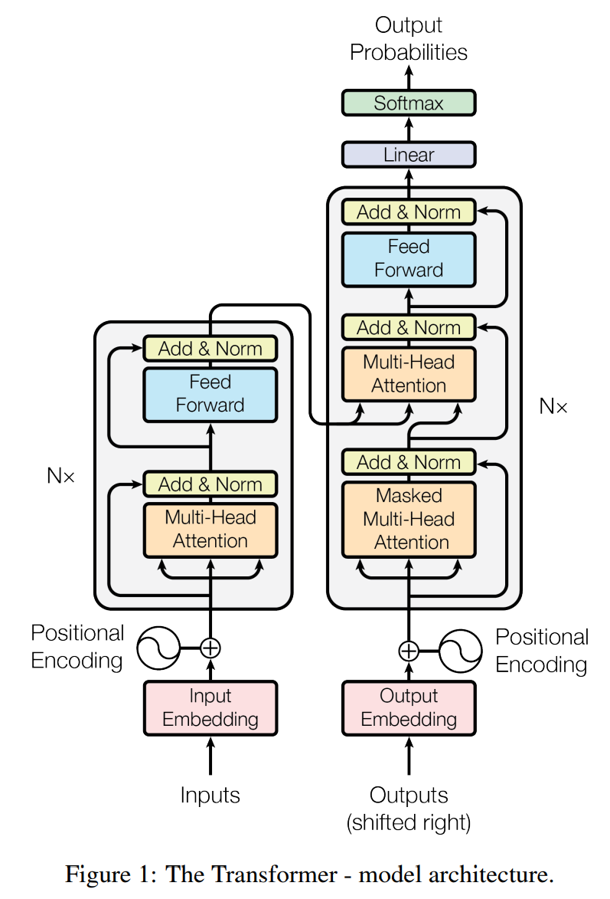

# Transformer框架与细节

## 一、整体架构

&emsp;&emsp;细节一点：

## 二、Encoder
&emsp;&emsp;我们梳理一下Encoder的计算过程：
&emsp;&emsp;设输入是**Batch-size个句子**：$\mathbf{X}_{input}\in \mathbb{R}^{batch\_size\times input\_length}$

1. Embedding
$$
\begin{align}
\mathbf{X}=Word\_Embedding(\mathbf{X}_{input})+Positional\_Embedding(\mathbf{X}_{input}) \\

\end{align}
$$

&emsp;&emsp;其中$\mathbf{X}\in \mathbb{R}^{batch\_size \times input\_length \times embedding\_dim}$，embeding dim也即论文中的$d_{model}$。

2. Attention
$$
\begin{align}
\mathbf{X}_i=&softmax(\frac{(\mathbf{XW_Q}_i)(\mathbf{XW_K}_i)^T}{\sqrt{d}})(\mathbf{XW_V}_i) \\
\mathbf{X}&_{attention}=concat(\mathbf{X}_1,\mathbf{X}_2,\dots,\mathbf{X}_{n_{heads}})
\end{align}
$$

&emsp;&emsp;其中$\mathbf{X}_{attention}\in \mathbb{R}^{batch\_size \times input\_length \times d_{model}}$。

3. 残差连接与Layer Normalization
$$
\begin{align}
\mathbf{X}_{attention}=LayerNorm(\mathbf{X}_{attention}+\mathbf{X})
\end{align}
$$

4. FeedForward & 残差连接 & Layer Normalization

$$
\begin{align}
\mathbf{X}_{hidden}&=Linear(ReLU(Linear(\mathbf{X}_{attention})))\\
\mathbf{X}_{hidden}&=LayerNorm(\mathbf{X}_{attention}+\mathbf{X}_{hidden})
\end{align}
$$

&emsp;&emsp;其中$\mathbf{X}_{hidden}\in \mathbb{R}^{batch\_size \times input\_length \times d_{model}}$。注意第一个线性层将$d_{model}$放缩至$d_{ff}$，而第二个线性层再将$d_{ff}$放缩至$d_{model}$。
&emsp;&emsp;以上就是第一个 Encoder 的计算过程，再将$\mathbf{X}_{hidden}$重复第2~4步N次，得到Encoder的最终输出$Encoder\ output\in \mathbb{R}^{batch\_size \times input\_length \times d_{model}}$。

## 三、Decoder
&emsp;&emsp;Decoder的结构很多模块在 Encoder 中介绍了，不过细节略有不同。
&emsp;&emsp;有一个细节便是 Decoder 的输入。在 ***训练*** 时我们将 ground truth 左移一个token，将其作为 decoder input（使用 Teacher Focusing 的思想，用 ground truth 作为 decoder input 而不是模型的输出），经 decoder 后得到 output。我们再将 ground truth 末尾添加一个 token 作为 target，与 output 计算 loss 并 backward。
&emsp;&emsp;也即在训练时：

* input：我/爱/机/器/学/习
* ground truth：I/love/machine/learning
* decoder input：<start>/I/love/machine/learning
*  target：I/love/machine/learning/<end>

&emsp;&emsp;对于 LSTM 等 RNN 模型，需逐步训练。而在 transformer 中通过 Mask Self Attention 即可并行化。
&emsp;&emsp;而在 ***预测*** 便只能逐步生成。
&emsp;&emsp;Decoder 计算过程如下：

1. Embedding
$$
\begin{align}
\mathbf{X}_D=Word\_Embedding(\mathbf{X}_{D\ input})+Positional\_Embedding(\mathbf{X}_{D\ input}) \\

\end{align}
$$

&emsp;&emsp;其中$\mathbf{X}_D\in \mathbb{R}^{batch\_size \times target\_length \times embedding\_dim}$。