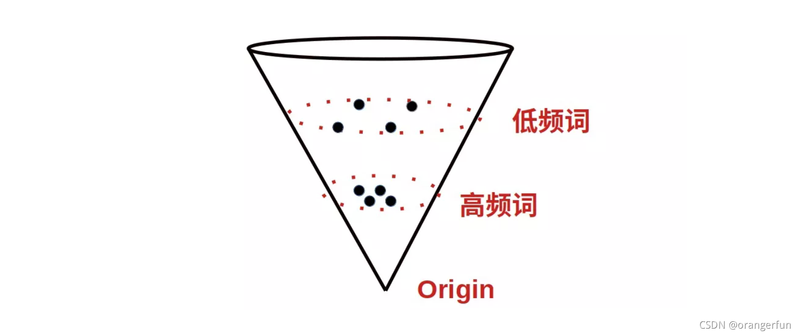

# BERT-flow
&emsp;&emsp;在 [[BERT词向量空间的各向异性]](https://github.com/HJHGJGHHG/NLPPapers/tree/main/%E6%96%87%E6%9C%AC%E8%A1%A8%E7%A4%BA%EF%BC%88Sentence%20Embedding%EF%BC%89/Analysis/BERT%E8%AF%8D%E5%90%91%E9%87%8F%E5%90%84%E5%90%91%E5%BC%82%E6%80%A7) 中我们分析了直接使用 BERT 做无监督向量抽取会有哪些问题。简而言之，表征空间向量分布不均匀，低频词分布稀疏距离原点较远，高频词分布紧密，距离原点较近，如下图：（[来源](https://blog.csdn.net/orangerfun/article/details/121540182)）

&emsp;&emsp;计算余弦相似度，首先需要向量所属的坐标系是标准正交基，即各方向单位向量正交且长度相等。