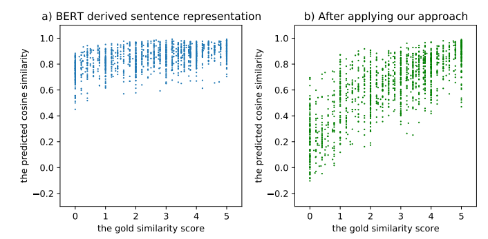
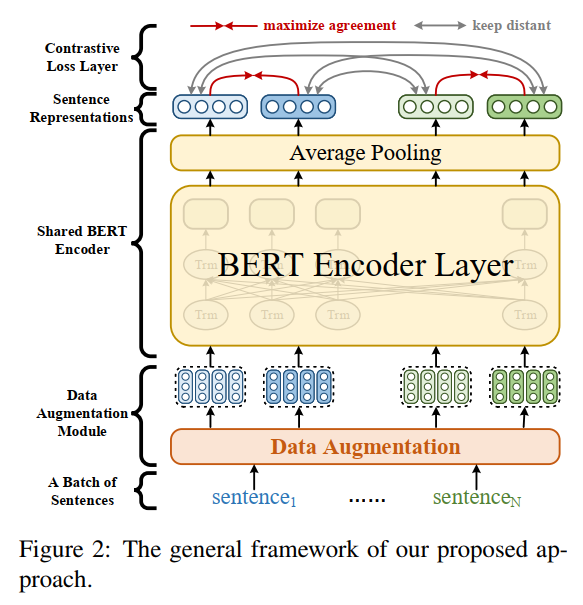
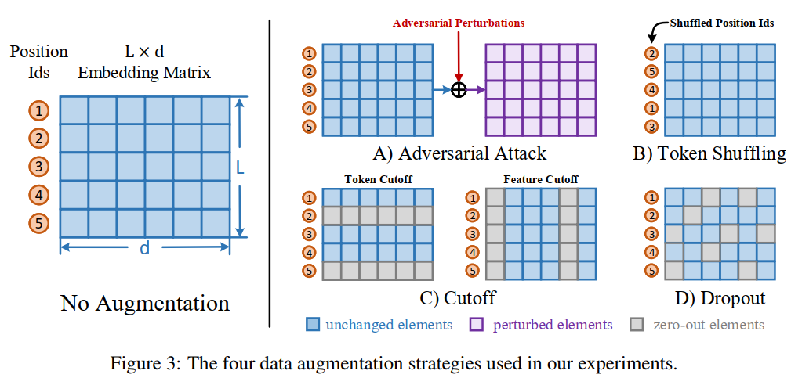

# ConSERT：花式数据增强
## 一、BERT 句向量坍缩问题
&emsp;&emsp;与 SimCSE 一样，文章首先分析了 BERT-AVG 产生的句向量存在的问题，称为坍缩，与各向异性是一个意思，换了种表达而已。

## 二、框架
&emsp;&emsp;与 SimCSE 也是完全一致的，同样有数据增强模块，通过优化对比损失来训练。

## 三、数据增强方法
&emsp;&emsp;ConSERT 同样采用的是 soft 的数据增强方法，放在了 Embedding 层，具体如下：

* Adversarial Attack。借鉴了对抗训练的思想，在有监督训练中加入扰动梯度。
* Token Shuffling。随机打乱输入序列中的字符顺序。值得注意的是，shuffle 策略相当于学习词袋模型，认为两个句子语义上的相关程度和语序无关，从细粒度来看这样确实会有问题；但就粗粒度来看的话，这种方法一定程度上确实能学习到语义的相关性，至少能将那些明显不相关的句子对（很可能不存在词共现）打一个很低的分数。感觉这种方法的效果与数据有关。
* Cutoff。随机擦除 $\mathcal L×d$ 特征矩阵中的一些字符（token Cutoff），或特征（feature Cutoff）。
* Dropout。通过特定概率随机丢弃字符嵌入层中的元素，并将其值设置为零。与 SimCSE 不同，这里的 dropout 只在 embedding 层，作者为了避免模型层中 dropout 的影响将其关闭了。
