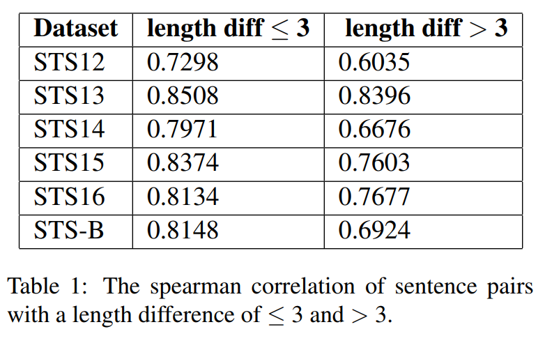
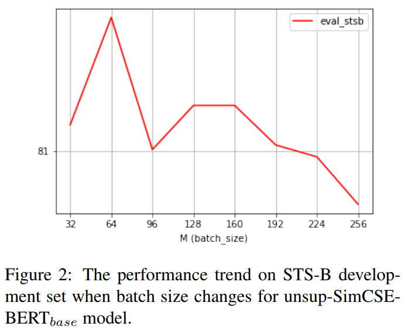
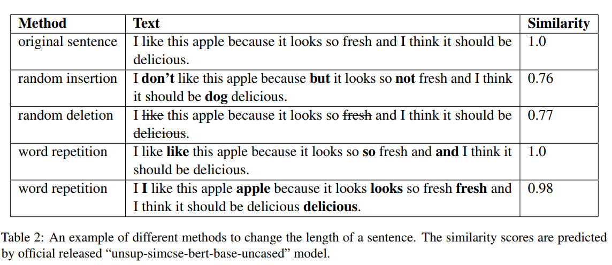
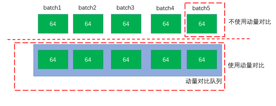
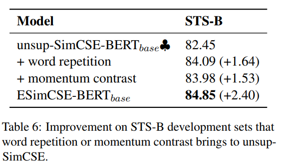

# ESimCSE：加强版 SimCSE
## 一、SimCSE 存在的问题
### 1. 长度信息
&emsp;&emsp;由于 Transformer-Based 的 PLM 有绝对位置编码，那么 SimCSE 通过 dropout 构建正例对包含相同长度的信息，这样会使模型倾向于认为句子长度相近的句子语义上也相似。  

### 2. batch size
&emsp;&emsp;作者发现，在 SimCSE 中，使用更大的 batch size 并不会带来更好的结果：

&emsp;&emsp;我在 SimCSE 的复现中也发现了这个问题，可是 why？？按理说加大batch size 可以构造出更多的负例对，还能降低伪负例的影响，可能太大的 batch size 反而增大的伪负例对？？作者指出根源在于负例对的构造。（in-batch 确实有点太 simple 了）

## 二、改进
### 1. Word Repetition
&emsp;&emsp;作者舍弃了使用 dropout 作为数据增强而使用 *单词重复*，即随机重复句子中的某个词/子词。相较于其他显式数据增强如随机添加与随机删除，作者发现单词重复对自然语义的影响最小。

&emsp;&emsp;设某个 tokenize 后的句子为 $x=\{x_1,x_2,\cdots,x_N\}$，随机采样数 $dup\_len \in [0,\max(2,int(dup\_rate\times N))]$，注意 $dup\_len$ 没有定死，作者说是能进一步拓展多样性（不然又引入正例对长度差恒定的信息了），再以均匀分布采样，最后把采得的序列加入原序列中。

### 2. Momentum Contrast（动量对抗学习）
&emsp;&emsp;动量对抗最早是 CV 中提出的，用以扩大负例对的数量同时比直接扩大 batch size 要节省显存。核心就是在 SimCSE 的框架下额外维护一个固定大小的队列 $Q$ (一般比batch大很多)与一个队列 encoder 记为 $f_{\theta_{m}}$，初始时 $Q=\{\},f_{\theta_{m}}=f_{\theta_{e}}=PLM$，也即队列初始为空，$f_{\theta_{m}}$与 $f_{\theta_{e}}$ 都为预训练模型。每次将句嵌打入队列，如果队满则最早入队者出队。训练时不仅将 in-batch 的所有其他句嵌作为负例，还将队列中其他 batch 都视为负例。如下图：（[来源]([(6条消息) 广告行业中那些趣事系列47：NLP中对比学习SOTA必学模型ESimCSE_abc50319的专栏-CSDN博客](https://blog.csdn.net/abc50319/article/details/122007687?ops_request_misc=%7B%22request%5Fid%22%3A%22164189264316781685365640%22%2C%22scm%22%3A%2220140713.130102334.pc%5Fall.%22%7D&request_id=164189264316781685365640&biz_id=0&utm_medium=distribute.pc_search_result.none-task-blog-2~all~first_rank_ecpm_v1~rank_v31_ecpm-4-122007687.first_rank_v2_pc_rank_v29&utm_term=esimcse&spm=1018.2226.3001.4187))）

&emsp;&emsp;值得注意的是，只有 $\theta_e$ 是通过梯度更新的（如果两个 encoder 都更新那就需要两个计算图，显存占用还是很大，就背离初衷了）。考虑到队列中存放的句嵌是未更新的 $\theta_m$ 得到的，所以我们还需 *缓慢更新*  $\theta_m$。有：$\theta_m \leftarrow \lambda \theta_m +(1-\lambda)\theta_e$。

## 三、结果
&emsp;&emsp;详细结果参见原论文，BERT base 相比 SimCSE 平均高出两个点，其他模型也有提升。消融结果：

&emsp;&emsp;可见本文提出的两个改进都是成功的。

