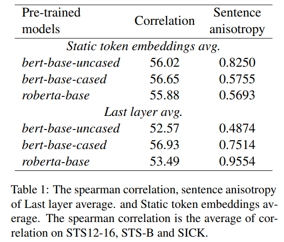
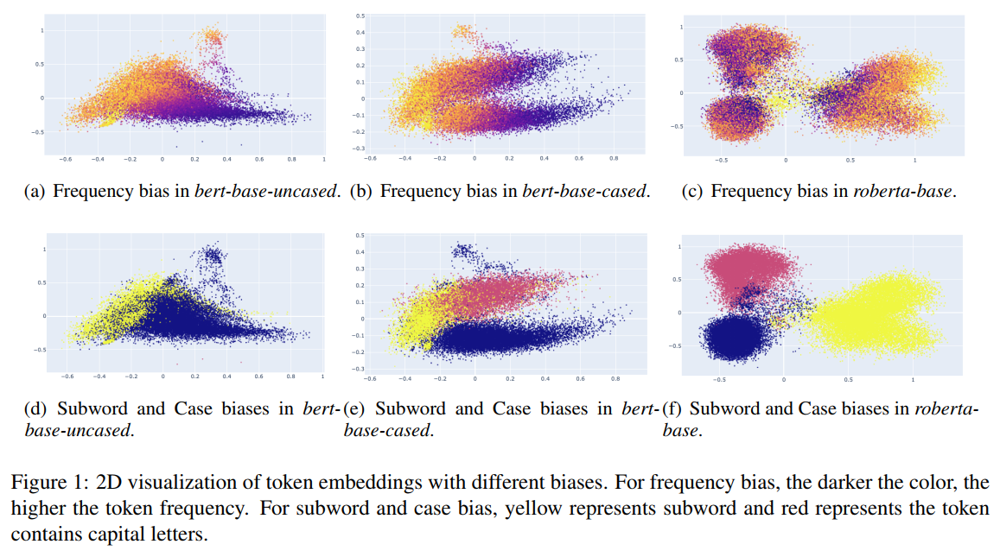
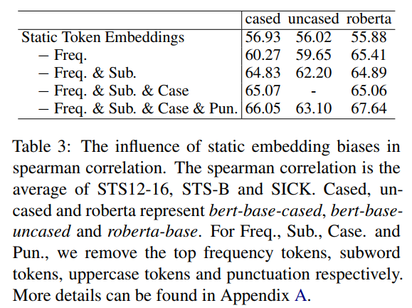

# Prompt-BERT
&emsp;&emsp;俗话说，打人不打脸...

> Even a non fine-tuned method can outperform the fine-tuned methods like unsupervised ConSERT on STS tasks  

## 一、Rethinking the Sentence Embeddings of Original BERT
&emsp;&emsp;Original BERT：未 Fine-tune 的原生 BERT。  
&emsp;&emsp;作者重新分析了 BERT 表征的缺陷的原因，之前文章说到的各向异性（Anisotropy）并不是主要原因并且提出了两个新的角度：
> However, we find that anisotropy is not a key factor to inducing poor semantic similarity by examining the relationship between the aniostropy and performance. We think the main reasons are the ineffective BERT layers and static token embedding biases.

### 1. Ineffective BERT layers
&emsp;&emsp;作者取了 BERT word Embedding 层以及最后一层两种方式在平均池化后作为句嵌，比较了 STS 任务的 spearman correlation 与随机 100000 条句子的 anisotropy。对于句子集 $\{s_1,\cdots,s_n\}$ 与 Embedding 函数 $M:\mathcal{X}\rightarrow \mathcal{H}$ ，则各向异性指标为：
$$
anisotropy\overset{def}{=}\frac{1}{n^2-n} |\sum_i \sum_{j\neq i} \cos(M(s_i),M(s_j))|
$$

&emsp;&emsp;对于各向同性的表征空间，随机 2n 个句子构成的集合的 anisotropy 应该为 0。实验结果：  

&emsp;&emsp;可以发现：word embedding 层甚至比最后一层的表现要好，证明 BERT 各层对于文本表示任务效率较低；而且 anisotropy 与 STS speatman 指标关系真的不大。

### 2. Embedding biases harms the sentence embeddings performance
&emsp;&emsp;何为 bias？BERT 的 embedding 会受词频、大小写与是否是 subword 有关。2 维可视化：

&emsp;&emsp;比如说 frequency bias 即是指：fre低的时候分布比较分散，而fre大的时候分布比较集中。  
&emsp;&emsp;如果手动去掉这些 bias 比如像 ConSERT 那样去掉高频词，效果就会好不少：  

&emsp;&emsp;作者认为这种 bias 与我们说的 anisotropy 不同：  

> The bias means the distribution of embedding is disturbed by some irrelevant information like token frequency, which can be directly visualized according to the PCA. For the anisotropy, it means the whole embedding occupies a narrow cone in the high dimensional vector space, which cannot be directly visualized.

&emsp;&emsp;（有点道理，所以说之前文章的可视化后的锥形其实说的是 bias？anisotropy  只有量化指标？好像又不太对...总感觉怪怪的）  

## 二、How to avoid bias?
&emsp;&emsp;接下来是文章的重头戏：使用 prompt 来避免 bias。（简单删除这种方法在句长较短时可能会删掉有意义的词）  
&emsp;&emsp;那么问题又来了，prompt 如何表征句子？如何设计合适的 prompt？

### 1. how to represent sentences with the prompt
&emsp;&emsp;主体是用单个 [MASK] 来表征。第一种思路是直接使用这个 [MASK] 的隐层状态来表征：$\mathbf{h}=\mathbf{h}_{[\mathrm{MASK}]}$。
&emsp;&emsp;第二个思路是根据 [MASK] 的隐层状态解码出 top-K 个 token， 再对这 k 个 token 的 word embedding 加权求和作为句子表征：
$$
\mathbf{h}=\frac{\sum_{v\in\mathcal{V}_{topK}} \mathbf{W}_v\mathrm{P}([\mathrm {MASK]}=v|\ \mathbf{h}_{\mathrm {[MASK]}})}{\sum_{v\in\mathcal{V}_{topK}} \mathrm{P}([\mathrm {MASK]}=v|\ \mathbf{h}_{\mathrm {[MASK]}})}
$$
&emsp;&emsp;鉴于第二种方法又走回对 word embedding 做平均的老路了，还是会受到 bias 的影响，所以作者选择了第一种方法。

### 2. how to find a proper prompt for sentence embeddings
##### A. 手工设计
&emsp;&emsp;第一种方式是手工设计 prompt：

##### B. 使用 T5 生成模板
&emsp;&emsp;论文中说：
> Perhaps it is the gap between sentence embeddings and word definition. This method cannot generate better templates compared to manual searching.

&emsp;&emsp;没太看明白...这部分以后再补

##### C. soft prompt
&emsp;&emsp;也没太看明白...

## 三、结合 prompt 与对比学习
&emsp;&emsp;我们的基本思路就是使用不同的 template 生成不同的 view。设两个 template 诱导出的句嵌为 $\mathbf{h}_i$ 与 $\mathbf{h}'_i$，如果只是取正例对为 $(\mathbf{h}_i,\mathbf{h}'_i)$，负例对为 $(\mathbf{h}_i,\mathbf{h}'_j)$，则不能排除由于引入 prompt 而带来的额外信息，如 position embedding 等等。为了避免我们需要将这部分因素消除。具体而言就是直接将 template 输入 bert 得到 $\hat{\mathbf{h}}_i$，再用 $\mathbf{h}_i-\hat{\mathbf{h}}_i$ 做为最终句嵌。  
&emsp;&emsp;那么最终的对比学习训练目标：$$
l_i=-\log\frac{e^{\cos(\mathbf{h}_i-\hat{\mathbf{h}}_i,\mathbf{h}'_i-\hat{\mathbf{h}}'_i)/\tau}}{\sum_{j}^N e^{\cos(\mathbf{h}_i-\hat{\mathbf{h}}_i,\mathbf{h}'_j-\hat{\mathbf{h}}'_j)/\tau}} 
$$
