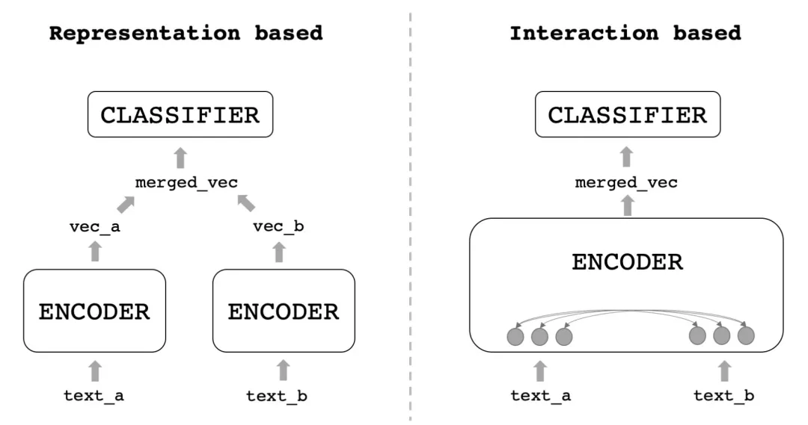

# Sentence Embedding
&emsp;&emsp;**句向量**是**文本表示**中一个重要领域（私认为是文本表示的最终目的，词向量很多时候最后还是要生成句向量），文本表示广泛应用于召回、聚类、分类、匹配等等很多领域。评价句向量多用句间关系任务完成，如句间相似度、句间语义关系推理、问答对等等。  
&emsp;&emsp;我们将句向量模型分为 Representation-based（双塔式） 与 Interaction-based（交互式）两类。双塔式模型即用一个编码器分别给两个文本编码出句向量，然后把两个向量融合过一个浅层的分类器；交互式就是把两个文本一起输入进编码器，在编码的过程中让它们相互交换信息，再得到最终结果。如下图：

## Benchmark & Datasets  
#### 1. Semantic Textual Similarity
* STS-B (SemEval 2017 Task 1: Semantic Textual Similarity - Multilingual and Cross-lingual Focused Evaluation)  [[home page]](http://ixa2.si.ehu.eus/stswiki/index.php/STSbenchmark)  
* STS-12 (SemEval-2012 task 6: A pilot on semantic textual similarity)  [[home page]](https://aclanthology.org/S12-1051/)
* STS-13 (SEM 2013 shared task: Semantic Textual Similarity)  [[home page]](https://aclanthology.org/S13-1004/)
* STS-14 (SemEval-2014 task 10: Multilingual semantic textual similarity)  [[home page]](https://aclanthology.org/S14-2010/)
* STS-15 (SemEval-2015 task 2: Semantic textual similarity, English, Spanish and pilot on interpretability)  [[home page]](https://aclanthology.org/S15-2045/)
* STS-16 (SemEval-2016 task 1: Semantic textual similarity, monolingual and cross-lingual evaluation)  [[home page]](https://aclanthology.org/S16-1081/)
* MRPC (Microsoft Research Paraphrase Corpus)  [[home page]](https://www.microsoft.com/en-us/download/details.aspx?id=52398)
* (Multilingual) PAWS-X (Paraphrase Adversaries from Word Scrambling)  [[home page]](https://github.com/google-research-datasets/paws)
* (Chinese) LCQMC (A Large-scale Chinese Question Matching Corpus, COLING 2018)  [[home page]](http://icrc.hitsz.edu.cn/info/1037/1146.htm)
* (Chinese) AFQMC (Ant Financial Question Matching Corpus, 蚂蚁金融语义相似度数据集)  [[home page]](https://tianchi.aliyun.com/dataset/dataDetail?dataId=106411)
* (Chinese) OPPO 小布对话文本语义匹配数据集  [[home page]](https://tianchi.aliyun.com/competition/entrance/531851/introduction)
* (Chinese) PKU-Paraphrase-Bank (北大中文文本复述数据集)  [[home page]](https://github.com/pkucoli/PKU-Paraphrase-Bank/)
* (Chinese) Chinese STS-B  [[home page]](https://github.com/pluto-junzeng/CNSD)
* (Chinese) 中文地址解析数据集 (CCKS 2021)  [[home page]](https://tianchi.aliyun.com/dataset/dataDetail?dataId=110146) 
* (Chinese) ATEC 语义相似度学习赛数据集  [[source]](https://github.com/IceFlameWorm/NLP_Datasets/tree/master/ATEC)
* (Chinese) BQ (A Large-scale Domain-specific Chinese Corpus For Sentence Semantic Equivalence Identification) (EMNLP 2018)  [[home page]](http://icrc.hitsz.edu.cn/info/1037/1162.htm)

#### 2. Natural Language Inference（NLI）
* SICK-R (SemEval-2014 task 1: valuation of compositional distributional semantic models on full sentences through semantic relatedness and textual entailment)  [[home page]](https://marcobaroni.org/composes/sick.html)
* (Chinese) Chinese MNLI [[zip]](https://storage.googleapis.com/cluebenchmark/tasks/cmnli_public.zip)
* (Chinese) Chinese SNLI [[home page]](https://gitee.com/jiaodaxin/CNSD)
* (Chinese) OCNLI (原生中文NLI数据集)  [[zip]](https://storage.googleapis.com/cluebenchmark/tasks/ocnli_public.zip)
* (Chinese) CINLID (中文成语语义推理数据集)  [[home page]](https://www.heywhale.com/mw/dataset/608a8c45d0bc41001722dc37/content)

## Interaction-based
* **BERT: Pre-training of Deep Bidirectional Transformers for Language Understanding.** *Jacob Devlin Ming-Wei Chang Kenton Lee Kristina Toutanova* [[code]](https://github.com/google-research/bert) -***BERT*** [[notes]](https://github.com/HJHGJGHHG/NLPPapers/tree/main/PLM/BERT) 

## Representation-based
* **Learning Deep Structured Semantic Models
for Web Search using Clickthrough Data**  *Xiaodong He, Jianfeng Gao, Li Deng, Alex Acero, Larry Heck* [[pdf]](https://www.microsoft.com/en-us/research/wp-content/uploads/2016/02/cikm2013_DSSM_fullversion.pdf) [[code]](https://github.com/InsaneLife/dssm) -***DSSM***
* **Siamese Recurrent Architectures for Learning Sentence Similarity**  *Aditya Thyagarajan*  (AAAI 16) [[home page]](https://ojs.aaai.org/index.php/AAAI/article/view/10350)  [[code]](https://github.com/dhwajraj/deep-siamese-text-similarity) -***Siam-LSTM***  [[my code]](https://github.com/HJHGJGHHG/NLPPapers/tree/main/%E6%96%87%E6%9C%AC%E8%A1%A8%E7%A4%BA%EF%BC%88Sentence%20Embedding%EF%BC%89/Siam-LSTM/code)
* **Skip-Thought Vectors**  *Ryan Kiros, Yukun Zhu, Ruslan Salakhutdinov, Richard S. Zemel, Antonio Torralba, Raquel Urtasun, Sanja Fidler*  (NIPS 2015)  [[pdf]](https://arxiv.org/pdf/1506.06726.pdf)  -***Skip-Thought***
* **On the Sentence Embeddings from Pre-trained Language Models**  *Bohan Li, Hao Zhou, Junxian He, Mingxuan Wang, Yiming Yang, Lei Li*  (EMNLP2020)  [[pdf]](https://arxiv.org/pdf/2011.05864.pdf)  [[code]](https://github.com/bohanli/BERT-flow)  -***BERT-flow***  [[notes]](https://github.com/HJHGJGHHG/NLPPapers/tree/main/%E6%96%87%E6%9C%AC%E8%A1%A8%E7%A4%BA%EF%BC%88Sentence%20Embedding%EF%BC%89/BERT-flow)
* **SimCSE: Simple Contrastive Learning of Sentence Embeddings**  *Tianyu Gaoy, Xingcheng Yaoz, Danqi Chen*  (EMNLP 2021)  [[pdf]](https://arxiv.org/pdf/2104.08821.pdf) [[code]](https://github.com/princeton-nlp/SimCSE)  -***SimCSE***   [[notes]](https://github.com/HJHGJGHHG/NLPPapers/tree/main/%E6%96%87%E6%9C%AC%E8%A1%A8%E7%A4%BA%EF%BC%88Sentence%20Embedding%EF%BC%89/SimCSE) [[my code]](https://github.com/HJHGJGHHG/NLPPapers/tree/main/%E6%96%87%E6%9C%AC%E8%A1%A8%E7%A4%BA%EF%BC%88Sentence%20Embedding%EF%BC%89/SimCSE/code)
* **ConSERT: A Contrastive Framework for Self-Supervised Sentence Representation Transfer**  *Yuanmeng Yan, Rumei Li, Sirui Wang, Fuzheng Zhang, Wei Wu, Weiran Xu*  (ACL 2021)  [[ACL pdf]](https://aclanthology.org/2021.acl-long.393.pdf)  [[code]](https://github.com/yym6472/ConSERT)  -***ConSERT***  [[notes]](https://github.com/HJHGJGHHG/NLPPapers/tree/main/%E6%96%87%E6%9C%AC%E8%A1%A8%E7%A4%BA%EF%BC%88Sentence%20Embedding%EF%BC%89/ConSERT)
* **ESimCSE: Enhanced Sample Building Method for Contrastive Learning of Unsupervised Sentence Embedding**  *Xing Wu, Chaochen Gao, Liangjun Zang, Jizhong Han, Zhongyuan Wang, Songlin Hu*  (preprint)  [[pdf]](https://arxiv.org/pdf/2109.04380.pdf)  -***ESimCSE***  [[notes]](https://github.com/HJHGJGHHG/NLPPapers/tree/main/%E6%96%87%E6%9C%AC%E8%A1%A8%E7%A4%BA%EF%BC%88Sentence%20Embedding%EF%BC%89/ESimCSE)  [[my code]](https://github.com/HJHGJGHHG/NLPPapers/tree/main/%E6%96%87%E6%9C%AC%E8%A1%A8%E7%A4%BA%EF%BC%88Sentence%20Embedding%EF%BC%89/ESimCSE/code)
* **Self-Guided Contrastive Learning for BERT Sentence Representations**  *Taeuk Kim, Kang Min Yoo, Sang-goo Lee*  (ACL 2021)  [[ACL pdf]](https://aclanthology.org/2021.acl-long.197.pdf)  [[notes]](https://github.com/HJHGJGHHG/NLPPapers/tree/main/%E6%96%87%E6%9C%AC%E8%A1%A8%E7%A4%BA%EF%BC%88Sentence%20Embedding%EF%BC%89/Self-Guided%20BERT)
* **PromptBERT: Improving BERT Sentence Embeddings with Prompts**  *Ting Jiang, Shaohan Huang, Zihan Zhang, Deqing Wang, Fuzhen Zhuang, Furu Wei, Haizhen Huang, Liangjie Zhang, Qi Zhang*  [[pdf]](https://arxiv.org/pdf/2201.04337v1.pdf)  [[code]](https://github.com/kongds/prompt-bert)  -***PromptBERT***  [[notes]]()

## Analysis
* **Representation Degeneration Problem in Training Natural Language Generation Models**  *Jun Gao, Di He, Xu Tan, Tao Qin, Liwei Wang, Tie-Yan Liu*  (ICLR2019)  [[pdf]](https://arxiv.org/pdf/1907.12009.pdf)  [[notes]](https://github.com/HJHGJGHHG/NLPPapers/tree/main/%E6%96%87%E6%9C%AC%E8%A1%A8%E7%A4%BA%EF%BC%88Sentence%20Embedding%EF%BC%89/Analysis/BERT%E8%AF%8D%E5%90%91%E9%87%8F%E5%90%84%E5%90%91%E5%BC%82%E6%80%A7)
* **Improving Neural Language Generation with Spectrum Control**  *Lingxiao Wang, Jing Huang, Kevin Huang, Ziniu Hu, Guangtao Wang, Quanquan Gu*  (ICLR2020)  [[pdf]](https://openreview.net/attachment?id=ByxY8CNtvr&name=original_pdf)  [[notes]](https://github.com/HJHGJGHHG/NLPPapers/tree/main/%E6%96%87%E6%9C%AC%E8%A1%A8%E7%A4%BA%EF%BC%88Sentence%20Embedding%EF%BC%89/Analysis/BERT%E8%AF%8D%E5%90%91%E9%87%8F%E5%90%84%E5%90%91%E5%BC%82%E6%80%A7)
* **Isotropy in the Contextual Embedding Space: Clusters and Manifolds**  *Xingyu Cai, Jiaji Huang, Yuchen Bian, Kenneth Church*  (ICLR2021)  [[pdf]](https://openreview.net/pdf?id=xYGNO86OWDH)   [[notes]](https://github.com/HJHGJGHHG/NLPPapers/tree/main/%E6%96%87%E6%9C%AC%E8%A1%A8%E7%A4%BA%EF%BC%88Sentence%20Embedding%EF%BC%89/Analysis/BERT%E8%AF%8D%E5%90%91%E9%87%8F%E5%90%84%E5%90%91%E5%BC%82%E6%80%A7) 