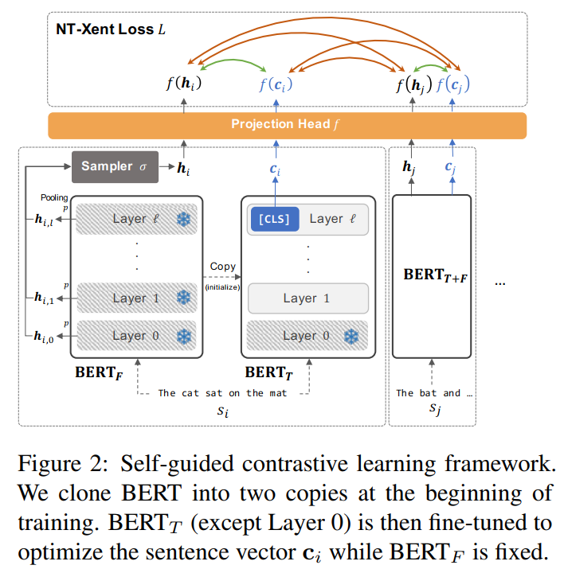
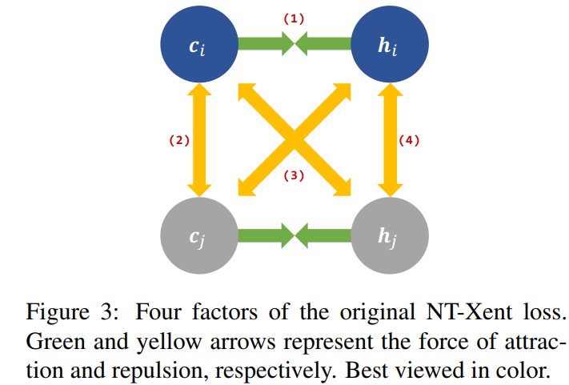

# Self-Guided BERT
&emsp;&emsp;如何在不引入外部资源与数据增强的情况下提高 BERT 表征空间质量？

## 一、Method
&emsp;&emsp;直接看模型架构图：

&emsp;&emsp;在 Fine-tune 过程中，取两个 BERT，一个固定（$BERT_{F}$）一个精调（$BERT_{T}$），正例对构造为 $BERT_{F}$ 池化后的隐层 $\mathbf{h}_i$ 与 $BERT_{T}$ 的 CLS：$\mathbf{c}_i$。  
&emsp;&emsp;负例对仍然是 In-batch，不过有4种排列组合方式：

&emsp;&emsp;训练目标除了 CL Loss 之外，还加入了正则化项：$L^{reg}=||BERT_T-BERT_F||_2^2$，为了防止两个 BERT 相差过远。

## 二、感受
&emsp;&emsp;不知道大家看完有什么想法，我倒是觉得这个方法是 ~~画蛇添足~~ 锦上添花，虽然说比 sup-SimCSE 低一些，但是提出了一个新的思路。
&emsp;&emsp;槽点依旧很多，一是不使用数据增强，同一个 input 过两个 BERT 区别真的不是很大；再一个就是 $L^{reg}$，到底是要 finetune 还是不要 finetune？不妨借鉴 ESimCSE 动量更新一下 $BERT_F$。