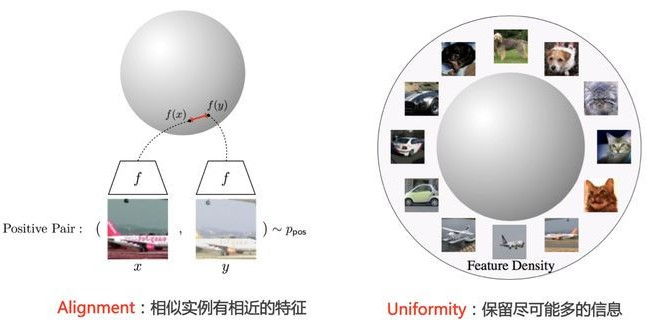
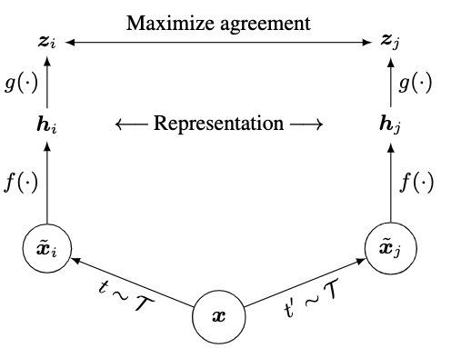
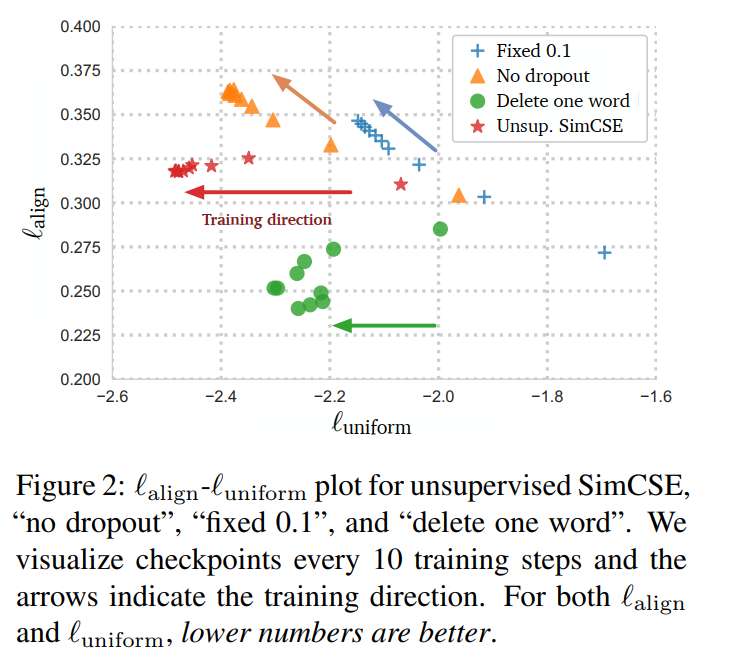

# 对比学习与 SimCSE
## 一、对比学习
&emsp;&emsp;我们知道，sentence embedding 的目标是学习一个表征空间 $\mathcal{H}\in \mathbb{R}^{embedding\_ dim}$ 与表征函数 $f:\mathbb{R}\rightarrow \mathcal{H}$ 。如何评价这个表征空间呢？[[这篇文章]](https://arxiv.org/abs/2005.10242) 给出了两个评价指标：（设我们有一个 pair 对样本集合 $\mathcal{D}=\{(x_i,x_i^+)\}_{i=1}^{m}$，其中 $x_i$ 与 $x_i^+$ 为相似样本，即***正例对***）
1. Alignment：正例对之间的向量距离的期望  
$$
\mathcal{l}_{alignment}\overset{\underset{\mathrm{def}}{}}{=}\mathbb{E}\ ||f(x)-f(x^+)||^2,\ x,x^+ \in \mathcal{D}
$$

2. Uniformity：所有数据向量均匀分布的程度  
$$
\mathcal{l}_{uniformity}\overset{\underset{\mathrm{def}}{}}{=}\log\mathbb{E}\ e^{-2||f(x)-f(y)||^2}, \ x,y\overset{\underset{\mathrm{i.i.d}}{}}{\sim} p_{\mathcal{D}}
$$

&emsp;&emsp;由 Alignment 我们知道，越相似的句对在 $\mathcal{H}$ 中也越接近；而由 Uniformity 有我们的向量在 $\mathcal{H}$ 中应该尽量均匀。在分布均匀的情况下系统能尽可能区分开不同句子，也即系统保留了尽可能多的信息。很显然，Alignment 与 Uniformity 都应该越小越好。  

&emsp;&emsp; 那么对比学习是如何学习 $\mathcal{H}$ 的呢？简而言之就是***通过对比，拉近相似样本之间的距离，推远不相似样本之间的距离***。对比学习方法根据数据集的不同可以分为两类：
* 有监督对比学习：$\mathcal{D}=\{(x_{1i},x_{2i},label)\}_{i=1}^m$，可以通过将监督样本中的相同label的样本作为正样本，不同label的样本作为负样本，来进行对比学习；
* 无监督对比学习：$\mathcal{D}=\{x_i\}_{i=1}^m$，由于没有监督信号 label，如何构造正负例对？我们接下来详细讨论这种情况。

&emsp;&emsp; 一个朴素的想法便是取 $(x_i,x_i)$ 为正例对，$(x_i,x_j),i\neq j$ 为负例对，当然这样的泛化能力会很差。一般来说，我们会使用一些数据扩增手段，取 $(g(x_i),h(x_i))$ 为正例对，其中 $g$ 与 $h$ 为数据增强函数；将 $(g(x_i),h(x_j))$ 等视为负例对。这种框架下的对比学习核心就是***区分两个实例是否是由同一个源数据采样/增强得来。***其实就是让模型学习区分每个句子的最本质的特征~  

&emsp;&emsp; 那么如何选择合适的数据增广方法呢？传统的 EDA 与同义词替换，删除不重要的单词，语序重排等等本质上是在离散的 Token 空间上操作的，鲁棒性很差，容易引入负面噪声。  
&emsp;&emsp; 不同于 ConSERT 将修改放在 Embedding 层，SimCSE 给出了一个更加**简单**的方案（点题！！）：***将 Dropout 作为增强***！  

## 二、无监督 SimCSE
&emsp;&emsp; 接下来我们接着上文，介绍 SimCSE 的无监督版本。  
### 1. 正负例对构造 
&emsp;&emsp; 上文我们说到，SimCSE 使用 Dropout 构造正例对。我们设 $N=batch\_ size$，那么对于某个 batch ：${x_1,x_2,\cdots,x_N}$，让其通过 PLM 得到向量组 $\mathbf{h}_1^{(0)},\mathbf{h}_2^{(0)},\cdots,\mathbf{h}_N^{(0)}$，然后**再将这组句子过一遍 PLM** 得到 $\mathbf{h}_1^{(1)},\mathbf{h}_2^{(1)},\cdots,\mathbf{h}_N^{(1)}$，那么我们有正例对：$\{(\mathbf{h}_i^{(0)},\mathbf{h}_i^{(1)})\}_{i=1}^N$。而负例对是 in-batch negatives，就是将其他句子第二次通过 PLM 的向量作为负例，则有负例对： $\{(\mathbf{h}_i^{(0)},\mathbf{h}_j^{(1)})\}$。   
&emsp;&emsp; Dropout 本质是***临时*** ***随机***丢弃一部分神经元，所以直接通过两次 PLM 的结果会略有不同，但是二者的自然语义完全一致。  

### 2. 损失函数
&emsp;&emsp; 在一个 batch 内，我们有优化目标：  
$$
\min-\sum_{i=1}^N \log\frac{e^{sim(\mathbf{h}_i^{(0)},\mathbf{h}_i^{(1)}/\tau)}}{\sum_{j=1}^N e^{sim(\mathbf{h}_i^{(0)},\mathbf{h}_j^{(1)}/\tau)}}
$$

&emsp;&emsp; 其中 $sim$ 为两个句子的余弦相似度函数，即 $sim(\mathbf{h}_1,\mathbf{h}_1)=\frac{\mathbf{h}_1^T\mathbf{h}_2}{||\mathbf{h}_1||\cdot ||\mathbf{h}_2||}$。

## 三、监督 SimCSE
&emsp;&emsp;核心都是相同的，只是利用 NLI 数据集并且修改了正负例对于损失函数的定义罢了，这里就不展开了。  

## 四、细节
&emsp;&emsp;接下来对 SimCSE 中的相关细节做进一步分析~  
### 1. 伪负例问题
&emsp;&emsp;在 SimCSE 中，我们选择一个 batch 中的所有其他样本作为负例，我们称负例中有**语义很相似**的样本为伪负例。很显然伪负例会极大程度地干扰模型。  
&emsp;&emsp;我们可以使用增大语料库，随机 shuffle，增大 batch size 等方法降低伪负例的影响。当然选择更合理的负例构造也是很好的思路。  

### 2. 公式（3）中温度系数 $\tau$ 的作用
&emsp;&emsp;一个定性分析：公式（3）去掉 log 与 $\tau$ 就是一个 Softmax，而由于余弦相似度的值域是 [−1,1]，范围太小导致 Softmax 无法对正负样本给出足够大的差距，最终结果就是模型训练不充分，所以需要一个较小的 $\tau$ （论文中为 0.05）适量放大 logits。  
&emsp;&emsp;具体的分析见 [[温度超参的作用]](https://github.com/HJHGJGHHG/NLPPapers/blob/main/%E6%96%87%E6%9C%AC%E8%A1%A8%E7%A4%BA%EF%BC%88Sentence%20Embedding%EF%BC%89/SimCSE/%E6%B8%A9%E5%BA%A6%E8%B6%85%E5%8F%82%E7%9A%84%E4%BD%9C%E7%94%A8.md)

### 3. 对比学习与各项异性问题
&emsp;&emsp;见 [[对比学习与表征空间各向异性]](https://github.com/HJHGJGHHG/NLPPapers/blob/main/%E6%96%87%E6%9C%AC%E8%A1%A8%E7%A4%BA%EF%BC%88Sentence%20Embedding%EF%BC%89/SimCSE/%E5%AF%B9%E6%AF%94%E5%AD%A6%E4%B9%A0%E4%B8%8E%E8%A1%A8%E5%BE%81%E7%A9%BA%E9%97%B4%E5%90%84%E5%90%91%E5%BC%82%E6%80%A7.md)

## 五、问题与思考
### 1. SimCSE 的缺陷
&emsp;&emsp;直接使用 BERT 内部天然的 dropout 作为增强方法，虽然简单，但还是有很多遗留问题，具体参见 [SimCSE 加强版！]()

### 2. 无监督训练停止策略
&emsp;&emsp;SimCSE 可以拉远负例对表示，从而缓解了坍缩到一起的问题，那么问题来了，拉远到什么程度是个头呢？SimCSE 包括 ConSERT 都是用 STS-B 开发集频繁评估，保留最佳效果作为 checkpoint，但这种做法显然不是像预训练那种真正的无监督训练，如何构建更合理的停止策略呢？

### 3. 
&emsp;&emsp;论文中给出了这张图：

&emsp;&emsp;比较了各种 dropout 策略与随机删除一个词的 alignment 与 uniformity。问题是 ***Fixed 0.1*** 与 ***No dropout*** 两个方法中，正例对两个向量完全相同，那为什么 alignment 效果会变差呢？？