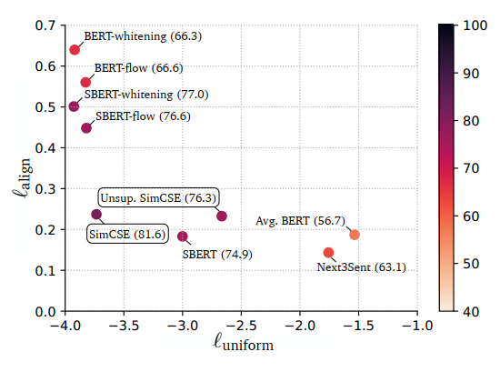

# 对比学习与表征空间各向异性
&emsp;&emsp;在之前的模型中我们介绍了 Transformer-based 模型抽取的表征空间会有严重的各向异性问题。接下来我们将证明 SimCSE 能缓解该问题。  
&emsp;&emsp;参考：https://wmathor.com/index.php/archives/1580/

## 一、理论分析
&emsp;&emsp;当负样本数量趋于无穷大时，有：
$$
\begin{align}
\ell_i&=-\log \frac{e^{\text{sim}(\boldsymbol{h}_i^{(0)},\boldsymbol{h}_i^{(1)})/\tau}}{\sum_{j=1}^N e^{\text{sim}(\boldsymbol{h}_i^{(0)},\boldsymbol{h}_j^{(1)})/\tau}}\\
&=-\log (e^{\text{sim}(\boldsymbol{h}_i^{(0)},\boldsymbol{h}_i^{(1)})/\tau})+\log \sum_{j=1}^N e^{\text{sim}(\boldsymbol{h}_i^{(0)},\boldsymbol{h}_j^{(1)})/\tau}\\
&= {\color{red}{-\frac{1}{\tau}\text{sim}(\boldsymbol{h}_i^{(0)},\boldsymbol{h}_i^{(1)})}} + {\color{blue}{\log \sum_{j=1}^N e^{\text{sim}(\boldsymbol{h}_i^{(0)},\boldsymbol{h}_j^{(1)})/\tau}}}
\end{align}
$$

&emsp;&emsp;取$f (x)=\boldsymbol {h}_{i}^{(0)},f (x^+)=\boldsymbol {h}_{i}^{(1)},f (x^-)=\boldsymbol {h}_{j}^{(1)}$ 有：
$$
\begin{aligned}
{\color{red}{-\frac{1}{\tau}\text{sim}(\boldsymbol{h}_i^{(0)},\boldsymbol{h}_i^{(1)})}} \propto-\frac{1}{\tau}\mathop{\mathbb{E}}\limits_{(x,x^+)\sim p_{\text{pos}}}\left[f(x)^Tf(x^+)\right]\\
{\color{blue}{\log \sum_{j=1}^N e^{\text{sim}(\boldsymbol{h}_i^{(0)},\boldsymbol{h}_j^{(1)})/\tau}}}\propto\mathop{\mathbb{E}}\limits_{x\sim p_{\text{data}}}\left[\log \mathop{\mathbb{E}}\limits_{x^-\sim p_{\text{data}}}\left[e^{f(x)^Tf(x^-)/\tau}\right]\right]
\end{aligned}
$$

&emsp;&emsp;此时训练目标线性等价为：  
$$
\begin{align}
\mathcal{L}(x)=-\frac{1}{\tau} \underset{(x,x^+)\sim p_{pos}}{\mathbb{E}} [f(x)^Tf(x^+)] + \underset{x\sim p_{data}}{\mathbb{E}} [\log \underset{x^-\sim p_{data}}{\mathbb{E}} [e^{f(x)^Tf(x^-)/\tau}]]

\end{align}
$$

&emsp;&emsp;这个式子其实很好理解，我们希望这个式子越小越好，那么 $\frac {1}{\tau}\mathop {\mathbb {E}}\limits_{(x,x^+)\sim p_{\text {pos}}}\left [f (x)^Tf (x^+)\right]$ （我们称为前一项）越大，后一项越小越好。前一项大，则说明正样本对之间的相似度大；后二项小，则说明负样本对之间的相似度小，这也是我们最终希望看到的模型表现，这不就是 alignment 和 uniformity 的意思么？？
&emsp;&emsp;我们可以借助 Jensen 不等式进一步推导第二项的下界：
$$
\begin{aligned}
\mathop{\mathbb{E}}\limits_{x\sim p_{\text{data}}}\left[\log \mathop{\mathbb{E}}\limits_{x^-\sim p_{\text{data}}}\left[e^{f(x)^Tf(x^-)/\tau}\right]\right]&=\frac{1}{m}\sum_{i=1}^m\log (\frac{1}{m}\sum_{j=1}^m e^{\boldsymbol{h}_i^T \boldsymbol{h}_j / \tau})\\
&\ge \frac{1}{\tau m^2} \sum_{i=1}^m \sum_{j=1}^m\boldsymbol{h}_i^T \boldsymbol{h}_j
\end{aligned}\tag{5}
$$

&emsp;&emsp;一下我们的终极目标是要优化式 (3)，或者说最小化式 (3) 的第二项。设   $\mathbf {W}$ 为 $\{x_i\}_{i=1}^m$ 对应的 Sentence Embedding 矩阵，那么此时优化第二项等价于最小化 $\mathbf {W}\mathbf {W}^T$ 的上界。为什么？因为 $\text {Sum}(\mathbf {W}\mathbf {W}^T)=\sum_{i=1}^m \sum_{j=1}^m\boldsymbol {h}_i^T \boldsymbol {h}_j$！假设我们已经标准化了 $\boldsymbol {h}_i$，此时 $\mathbf {W}\mathbf {W}^T$ 的对角线元素全为 1，$\text {tr}(\mathbf {W}\mathbf {W}^T)$ 为特征值之和，是一个常数。如果 $\mathbf {W}\mathbf {W}^T$ 的所有元素均为正值，则  $\text {Sum}(\mathbf {W}\mathbf {W}^T) $ 是 $\mathbf {W}\mathbf {W}^T$ 最大特征值的上界，因此，当我们最小化第二项时，其实是在间接最小化 $\mathbf {W}\mathbf {W}^T$ 的最大特征值，也就是隐式地压平了嵌入空间的奇异谱，或者说使得嵌入空间的分布更均匀。

## 二、实验结果

&emsp;&emsp;可以发现性能更优的模型通常有着更好的 alignment 和 uniformity，BERT 虽然有很好的 alignment，但 uniformity 太差，而基于后处理的 BERT-flow 和 BERT-whitening 又恰恰走向了另一个极端，SimCSE 则是对这两个指标的一个很好的平衡，加入监督训练后，SimCSE 的两个指标会同时提升。